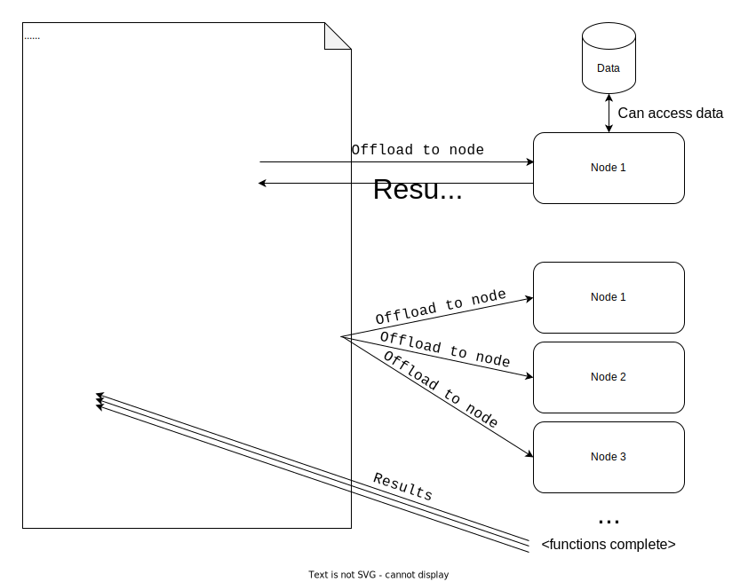
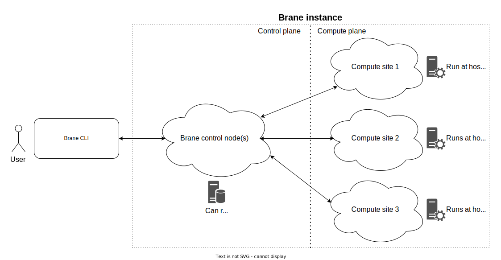

# Appendix A: Figures
We provide a complete overview of all figures in the entire book in this appendix chapter.

The figures are ordered by part and then by chapter. The figure numbering is consistent with the order in which they appear in the text.

To jump the original occurance of the figure, click the image itself or click on the link below it.

## Framework design
### 3. Framework capabilities
[</img>](../design/framework-capabilities.md#fig1)
_[Figure 1](../design/framework-capabilities.md#fig1): The structure of offloading package calls to compute nodes. Because each package is self-contained, we can very easily implement parallelization by simply making the schedule of the call non-blocking._

### 5. Toplevel design
[</img>](../infrastructure/toplevel-design.md#fig2)
_Figure 2: The broadest overview of the Brane framework model. It shows how a user can interact with the server (a Brane instance) via a client (a Brane CLI)._

[</img>](../infrastructure/toplevel-design.md#fig3)
_Figure 3: Broad overview of the Brane framework model. It shows how a user may interact with the server (a Brane instance) via a client (a Brane CLI). Furthermore, it shows how the Brane instance is split into a control plane (left) and a compute plane (right)._
