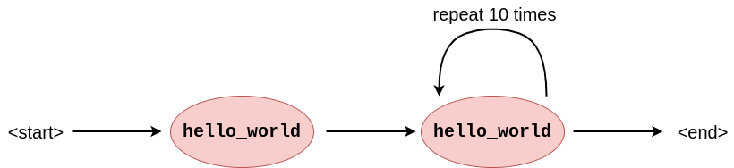

# Features
In this chapter, we explain BraneScript from a user experience perspective. We go over the main design choices and language concepts it features to understand what the rest of this appendix is working towards.

If you are already familiar with BraneScript as a user and want to learn how to parse it, refer to the [Formal grammar](./syntax.md) chapter; if you are instead interesting in compiling the resulting AST to the [Workflow Intermediate Representation](../../../spec/wir/introduction.md) (WIR), refer to the [subsequent chapters](TODO) instead.


## BraneScript: A scripting-like language
Primarily, BraneScript is designed to emulate a scripting-like language for defining workflows. As such, it is not approximating a graph structure, as workflows are typically represented, but instead defines a series of statements and expressions that can arbitrarily call external tasks. This means the language is very similar in usage as [Lua](https://lua.org) or [Python](https://wiki.python.org), "unfolding" to a workflow more than directly encoding it. Listing 1 shows an example BraneScript snippet.

```bscript
// Import a package that defines external tasks
import hello_world;

// Print some text running it on a particular location!
#[on("site_1")]
{
    println("A message has come in:");
    println(hello_world());
}


// Print a lot more text running it on another location!
#[on("site_2")]
{
    println("Multiple messages coming in!:");
    for (let i := 0; i < 10; i := i + 1) {
        print("Message "); print(i); print(": ");
        println(hello_world());
    }
}
```
_**Listing 1**: Example BraneScript snippet showing how the language looks using a typical "Hello, world!" example._

At compile time, the statements are analysed by the compiler to derive the intended workflow graph. Such a graph matching Listing 1 can be found in Figure 1.

  
_**Figure 1**: Workflow graph that can be extracted from Listing 1. It shows the initial task execution and then the repeated execution of the same function. In practise, this loop might be unrolled for simpler analysis, but this cannot always be done (e.g., conditional loops)._


## Main concepts
BraneScript leans on well-established concepts from other programming languages.

First, a BraneScript program is defined as a series of _statements_. These are the smallest units of coherent programs. Statements typically indicate control flow between expressions (see below), where particular constructs can be used for particular types of flow (e.g., if-statements, for-loops, while-loops, parallel-statements, etc). Like most scripting languages, they needn't be nested in a function (see below).

Actual work is performed in _expressions_, which can be thought of as imperative formulas creating, transforming and consuming values. Aside from _literal values_ (booleans, integers, real numbers, strings), BraneScript also supports _arrays_ of values (i.e., dynamically-sized containers of multiple of the same values) and _classes_ (i.e., statically-sized containers of different values). Operations supported in expressions are logical operations (conjunction, disjunction), arithmetic operations (addition, subtraction, multiplication, division, modulo) and comparison operators. Operations like array indexing or function calls are also supported.

BraneScript also has a concept of _variables_, which can remember values across statements. Essentially, these are named segments of memory that can be assigned values that can later be read.

_Functions_ can be used to make the codebase more efficient, or implement specific programming paradigms (such as [recursion](https://en.wikipedia.org/wiki/Recursion)). Concretely, they are named series of statements that can be called in the middle of other statements, allowing the re-use of particular snippets of code at certain moments. Like most other languages, functions can take in values as arguments to configure their execution, and output a value to contribute to the site where they were called. Classes can also be associated with functions to define _class methods_.

Finally, specific to BraneScript, _external functions_ are imported as _packages_ and executed like normal functions. However, instead of executing BraneScript statements, these functions execute a workflow task dynamically on Brane infrastructure. Their result is translated back to BraneScript concepts.


## Statements
This section lists the specific statements supported by BraneScript.

### Expression statements
```bscript
println("Hello, world!");
42 + 42;
55 + add(33, 44);
```
Expression statements represent the straightforward execution of a particular [expression](#expressions). The result of the expression is not stored (see [below](#let-assignments)), and so it is typically used for function calls which do not return a value, or if we're not interested in the returned value.

### (Let) Assignments
```bscript
// Example assignment to new variables
let value := 42;

// Example assignment to existing variables
value := 42 * 2;
```
Let assignments are like [expression statements](#expression-statements), except that the value computed by the expression _is_ stored in a variable.  
There are two versions of this syntax: first, there is the _let assignment_, which can be used to declare a variable and immediately assign it a particular value. Then, once the variable has been declared, its value can be updated using a normal _assignment_.

### If-statements
```bscript
// This assigns either 42 or 82, depending on the value of `foo`
let foo := true;
let bar := null;
if (foo) {
    bar := 42;
} else {
    bar := 84;
}

// The variation that only defines a true-branch
let foo := true;
let bar := null;
if (foo) {
    bar := 42;
}
```
If-statements represent a conditional divergence in control flow. It analyses a given expression that evaluates to a boolean, and executes one of two branches of statements: the top one if the value is true, or the bottom one if it's false.  
A variation of this statement exists where the second branch may be omitted if it contains no statements.

### While-loops
```bscript
let counter := 0;
while (counter < 10) {
    println("Hello, world!");
    counter := counter + 1;
}
```
Sometimes, a series of statements needs to be repeated a conditional number of times. In these cases, a while-loop can be used; it repeats a series of statements as long as the given boolean expression evaluates to true.

### For-loops
```bscript
for (let i := 0; i < 10; i := i + 1) {
    println("Hello, world!");
}
```
As syntax sugar for a [while-loop](#while-loops), a for-loop also repeats a series of statements until a particular condition is reached. It is tailored more for iterations that are repeated a particular number of items instead of an arbitrary condition.  
The syntax of the for-loop is as follows. The input to the loop is separated into three parts using semicolons: the first is executed before the loop; the second is used as the while-loop's condition; and the last part is executed at the end of every loop.  
Note that, while the styling suggests a [C-like syntax](https://en.cppreference.com/w/c/language/for), it is not as freeform as that. Instead, only the name of the variable (`i`, in the example), the condition (`i < 10`) and the increment-expression (`i + 1`) can be changed.

### Parallel statements
```bscript
// Execute stuff in parallel!
parallel [{
    println("Hello, world! 1");
}, {
    println("Hello, world! 2);
}];

// Alternative form to return a value (and showing multiple branches are possible)
let result := parallel [all] [{
    return 42;
}, {
    return 84;
}, {
    return 126;
}];
```
The parallel-statement is slightly more unique to BraneScript, and denotes that two series of statements can be executed in parallel. This is mostly useful when either contains [external function calls](TODO), but in practise also launches the BraneScript statements concurrently.  
There are two forms of the statement. In the first, work is just executed in parallel. In the second, a value may be returned from the branches (using a [return-statement](#return-statements)) that is aggregated somehow and placed in the variable preceding the statement. How the variables are aggregated is denoted by the [merge strategy](TODO) (`[all]` in the example).

### Block statements
```bscript
// We can nest statements in a block arbitrarily to play with scoping rules
let foo := 42;
println(foo);         // 42
{
    // Shadowed!
    let foo := 84;
    println(foo);     // 84
}
println(foo);         // 42
```
Typically, _blocks_ of statements are used in [function declarations](#function-declarations), [if-statements](#if-statements) or other constructs. Essentially, they just group statements together visually. However, importantly, blocks also directly define [scopes](TODO), i.e., they specify which variables are visible and thus usable for the programmer. When using a block as a separate statement, it is used to introduce an additional scope to shadow variables or free values early.

### Function declarations
```bscript
// A function without arguments
func hello_world() {
    println("Hello, world!");
}

// A function _with_ arguments!
func add(lhs, rhs) {
    return lhs + rhs;
}
```
Functions can be used to group statements under a particular name, which can then later be [called](#call-expression). The function declarations define which statements are executed, and which _arguments_ the function has as input. Syntactically, these are represented as variables scoped to the function and populated when a call is performed.  
To return a value from the function to the calling scope, use [return-statements](#return-statements).

### Return statements
```bscript
// Returns '42' from the workflow
return 42;

// Only interrupts the control flow, returns nothing
return;
```
To return values from functions, a return-statement may be used. It has two variants: if given without expression, then the statement only interrupts the control flow by terminating the function early. If given with, then it sets the value of the given expression as the value returned by the function call.  
Note that return-statements can also be used in the toplevel of the script to return values from the workflow as a whole (or early-terminate it). Similarly, they can be used in the branches of a [parallel-statement](#parallel-statements) to interrupt or return values.

### Import statements
```bscript
// Import the latest available version of a package
import hello_world;

// Or a specific version
import hello_world[1.0.0];
```
Unique to BraneScript are import-statements, which are used to bring the external functions of packages into scope. They can either be given without version number, in which case the latest version is used, or with, in which case the given version is used when importing.  
Note that imports are always relative to the execution context, _not_ the compile context.

### Class declarations
```bscript
// A class is a statically-sized, heterogenous container of multiple values
class Test {
    value1: int;
    value2: string;

    // ...with functions that can act on it!
    func print(self) {
        print(self.value1);
        print(" and '");
        print(self.value2);
        println("'");
    }
}
```
Oftentimes, it is practical to group multiple values together. A BraneScript _class_ is one way of doing so. Unlike [arrays](array-expression), classes can contain values of different types; but to do so, first they have to be statically defined so that the execution engine knows the shape of the class and how to access its contents.  
To support [OOP](https://en.wikipedia.org/wiki/Object-oriented_programming)-like programming paradigms, BraneScript classes can also be annotated _methods_. These are functions that act on a particular instance of a class, and come accompanied with convenient syntax for using them. Note, however, that BraneScript misses a few features for using full OOP; for example, there is no way to define object inheritance.  
Syntactically, the class is defined as a special kind of block that lists its contents (_fields_) as name/type pairs. A function can be given, which always takes `self` as first parameter, to define a method. Note that associated functions (i.e., functions without `self`) are not supported.

### Attributes
```bscript
#[on("foo")]
#[tag("amy.bar")]
#[something_else]
#![inner_annotation]
```
As a final BraneScript statement, _attributes_ (sometimes called _annotations_) can be used to provide some additional metadata to the compiler. While syntactically, any identifier can be used, only a few are recognized by the compiler, having their own syntax for arguments.

Attributes in the form of `#[...]` always annotate the first _non-attribute statement_ succeeding it. If this statement has nested statements (e.g., a [block](#block-statements), [if-statement](#if-statements), etc), then the attribute is propagated to all the nested statements as well. For example:
```bscript
#[attribute]
{
    // The if-statement is annotated with `attribute`
    if (true) {
        // And this expression-statement has `attribute` too
        println("Hello, world!");
    }
}
```

As an alternative syntax, the `#![...]`-form (not the exclaimation mark `!`) annotates every statement in the _parent_ block. To illustrate:
```bscript
// Same effect as the snippet above!
{
    #![annotate]

    // The if-statement is annotated with `attribute`
    if (true) {
        // And this expression-statement has `attribute` too
        println("Hello, world!");
    }
}
```
This latter form can be used to annotate an entire BraneScript file (e.g., `wf-tag`; see below).

The following attributes are currently recognized by the compiler:
- `on(<locs...>)` OR `loc(<locs...>)` OR `location(<locs...>)`: Explicitly states domains in a Brane instance where a particular external call must be executed. This can be used to implement Trusted Third-Parties, for example.
- `tag(<tags...>)` OR `metadata(<tags...>)`: Adds an arbitrary piece of metadata (a string) to external calls, which may be used by policy to learn information non-derivable from the call itself. An example of this would be GDPR-like purpose tags. Note that the tags must be given as `<owner>.<tag>`, where the owner is the domain or entity responsible for defining it.
- `wf-tag(<tags...>)` OR `workflow-tag(<tags...>)` OR `wf-metadata(<tags...>)` OR `workflow-metadata(<tags...>)`: Adds an arbitrary piece of metadata (a string) to the workflow as a whole, which may be used by policy to learn information non-derivable from the call itself. An example of this would be GDPR-like purpose tags. Note that the tags must be given as `<owner>.<tag>`, where the owner is the domain or entity responsible for defining it.


## Expressions
This section lists the particular operators and other constructs that can be used in BraneScript expressions.

Note that expressions are typically defined recursively, meaning that arbitrarily complex expressions can be built by nesting them (e.g., `42 + 42 - 42` nests either of the operators as expression of the other).

### Literals
```bscript
42
"Amy"
84.0
true
1.0.0
null
```
The simplest expression possible is a literal, which evaluates to the value written down. For every primitive data type, there is an associated literal; these are booleans, integers, real numbers, strings, version triplets and `null`.

### Variable access
```bscript
foo
```
Instead of providing a literal value, a variable can also be referenced. In that case, it evaluates to the value that was assigned to it most recently, of the type associated with the variable (see the rules about [typing](TODO)).

### Operators
```bscript
42 + 42
4 * 8
"Hello, " + "world!"
!true
-42
-82.0
42 % 4 - 3
```
Operators can be used to manipulate the results of other expressions. Available operators can be separated into roughly two classes: unary operators, which take only a single expression; and binary operators, which manipulate two expressions, usually aggregating them somehow.  
Note that operators are subject to _precedence_ (i.e., which operator should be considered first) and _associativity_ (i.e., in which order are the operators considered when all of the same type). These are discussed in the [formal grammar](./syntax.md) chapter.  
The following operators are available in BraneScript:
- _Logical operators_
  - **Negation** (`!<bool expr>`): "Flips" the boolean value (e.g., true becomes false and false becomes true).
  - **Conjunction** (`<bool expr> && <bool expr>`): Takes the logical conjunction of the two values (i.e., returns true iff both expressions are true).
  - **Disjunction** (`<bool expr> || <bool expr>`): Takes the logical disjunction of the two values (i.e., returns true iff at least one of both expressions is true).
- _Arithmetic operators_
  - **Addition** (`<int expr> + <int expr` OR `<real expr> + <real expr>` OR `<str expr> + <str expr>`): Adds two numerical values, or concatenates two strings.
  - **Subtraction** (`<int expr> - <int expr>` OR `<real expr> - <real expr>`): Subtracts the second value from the first.
  - **Multiplication** (`<int expr> * <int expr>` OR `<real expr> * <real expr>`): Multiplies two numerical values.
  - **Division** (`<int expr> / <int expr>` OR `<real expr> / <real expr>`): Divides the first value by the second.
  - **Modulo** (`<int expr> % <int expr>`): Returns the remainder after (integer) dividing the first value by the second.
- _Comparison operators_
  - **Equality** (`<expr> == <expr>`): Evaluates to true if the two values are the same (including of the same type), or false otherwise.
  - **Inequality** (`<expr> != <expr>`): Evaluates to true if the two values are _not_ the same (happens when they don't share the same type), or false otherwise.
  - **Less than** (`<int expr> < <int expr>` OR `<real expr> < <real expr>`): Evaluates to true if the first value is strictly lower than the second value.
  - **Less than or equal** (`<int expr> <= <int expr>` OR `<real expr> <= <real expr>`): Evaluates to true if the first value is lower than or equal to the second value.
  - **Greater than** (`<int expr> > <int expr>` OR `<real expr> > <real expr>`): Evaluates to true if the first value is strictly higher than the second value.
  - **Greater than or equal** (`<int expr> >= <int expr>` OR `<real expr> >= <real expr>`): Evaluates to true if the first value is higher than or equal to the second value.

### Function calls
```bscript
println("Hello, world!")
add(42, foo)
magic_number()
add(magic_number(), 42 / 2)
```
After a function has been [defined](#function-declarations), it can be called as an expression. It can be given arguments if the declarations declares them, which are nested expressions that should evaluate to the type required by that function.

After the call completes, the function call evaluates to the value returned by the function. Functions returning noting (i.e., `Void`) will always cause type errors when their value is used, so only use that as a "terminating" expression (i.e., one that is not nested in another expression and who's value is not used).

Note that calls to external functions (i.e., those [imported](#import-statements)) use the exact same syntax as regular function calls.

### Arrays
```bscript
[]
[1, 2, 3, 4]
[magic_numer(), 42 + 4, 88]
```
As an alternative to [classes](#class-declarations), arrays are part of BraneScript as ad-hoc containers for values of a shared type. In particular, and array can be thought of as a continious block of data of variable length.

Arrays can be constructed using [Python](https://python.org)-like syntax, after which they will evaluate to an array of the type of its elements. As it is an expression, it can be stored into variables and used for later.

### Array indexing
```bscript
foo[0]
[1, 2, 3][5]
generates_array()[4 - bar]
```
To access the contents of an array instead of the array as a whole, an index expression can be used. This takes in an expression evaluating to an array first, and then some (zero-indexed!) index into that array. The index expression as a whole evaluates to the selected element.

Note that using an index that is the same or higher than the length of the array will cause runtime errors.

### Class instantiation
```bscript
new Test { value1 := 42, value2 := "Hello, world!" };
new Jedi {
    name := "Obi-Wan Kenobi",
    is_master := true,
    lightsaber_colour := "blue"
}
new Data { name := "test" }
```
After a class has been [declared](#class-declarations), it can be _instantiated_, meaning that we create the container with appropriate values. The syntax used writes the fields as if they were assignments, taking the name before the `:=` and an expression evaluating to that field's type after it.

### Projection
```bscript
test.value1
jedi.is_master
big_instance.small_instance.value
```
Once a class has been [instantiated](#class-instantiation), its individual values may be accessed using _projection_. This selects a particular field in the given class instance, and evaluates to the most recently assigned value to that field.

The syntax is first an expression evaluating to an instance (including other projections!), and then an identifier with the field name.

Note that projections are special in that they may also appear to the left of a regular [assignments](#let-assignments), e.g.,
```bscript
test.value1 := 84;
```
may be used to update the values of fields in instances.


## Next
This defines the basic statements and expressions in BraneScript, and can already be used to write simple programs. Refer to the [user guide](/user-guide) to find more information about how to do so.

This documentation continues by going in-depth on some other parts of the language. In particular, subsequent chapters will deal with the [formal grammar](./syntax.md) of the language; [scoping rules](./scoping.md); [typing rules](./typing.md); [workflow analysis](./workflow.md); and other [compilation steps](./compilation.md). The final chapter in this series concludes with [future work](./future.md) planned for BraneScript.

If you're no longer interested in BraneScript, you can alternatively read another topic in the sidebar on the left.
