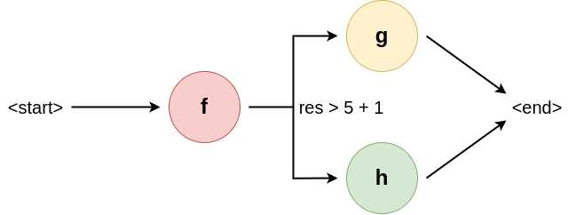

# Driver
The driver is arguably Brane's most important component. At the very least, it is the main engine of the framework, which executes a workflow and calls upon the other components to do so.

## Preparing workflows
The concern of a scientist is not to focus on the code and the implementation, but rather on only expressing the use-case in the system ([Assumption B3](../../requirements/requirements.md#assumption-b3)). To this end, users can submit incomplete workflows that are not yet suited for execution; for example, tasks may be unassigned to locations on which they should be run, or optimisations are not applied to make a workflow tractable.

Generally, the driver has to perform two tasks to resolve a workflow in a plan, i.e., a fully executable version:
1. Symbols must be resolved to retrieve metadata about tasks
2. The [planner](./planner.md) must be invoked to resolve the workflow

We will briefly highlight both of these separately.

### Resolving symbols
The driver is responsible for resolving symbols used in the workflow, since it adds vital context for the planner to be able to plan properly. This step is required due to a combination of factors: first, full specification in the task should be avoided to separate the concerns better, and to avoid incompatabilities between the metadata of a task (e.g., which parameters it needs) and the actualy implementation. Second, workflows are portable, and as such it is not guaranteed that a symbol always refers to the same task or that the task exists in the particular running instance.

As such, symbols used in the workflow representation must be resolved to what is known in the current instance. To retrieve the latter, the driver can make use of the [global audit log](./glog.md) which has knowledge of the current system state. This includes what each domain supplies to the framework in terms of tasks, as well as tasks uploaded by users.

### Utilitising the planner
Conceptually, planning is purely a preprocessing step that is done in the driver only. As such, practically, it might as well have been integrated into the conceptual driver.

However, in practise, it turns out that planning is a really hard problem because of the presence of domain-controlled data access rules (_policies_). As such, the driver instead calls upon a separate, dedicated component to solve this problem, freeing it up to handle new workflow requests or processes finished plans.

## Unspooling workflows
The main feature of the driver is that it acts as a workflow executor. From the perspective of the user, the driver acts like a virtual machine that takes their workflow representation, preprocesses it and then executes it at specified. From the perspective of the rest of the framework, this makes it the actual orchestrator component that hands out work to the rest.

Note that, because Brane's notion of workflow supports very flexible, scripting-like languages such as [BraneScript](../../appendix/languages/bscript/introduction.md), the execution functionality of the driver must also be quite complex. Most importantly, the driver is supposed to reason about the output of a given task to some extend to discover its influence on the remainder of the control flow, which means it must support full expressions, comparisons, basic arithmetic and more.

For example, we can take the workflow specified in **Figure 1**. The driver starts traversing it, executing function \\( f \\) first because its the first node in the graph. Then, the driver analyses the return value of \\( f \\) and must execute _either_ \\( g \\) or \\( h \\), depending on the condition specified. Which path must be taken cannot be determined beforehand, since the result of \\( f \\) isn't know statically time.

  
_**Figure 1**: Example workflow showing a branch. Intuitively, this workflow will run function \\( f \\) first, after which \\( g \\) is executed if the result of \\( f \\) is larger than 6, or \\( h \\) is executed otherwise._
