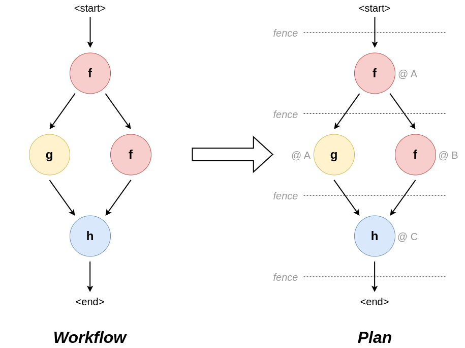

# Planner
The planner has the task of taking a submitted workflow from the [driver](./driver.md) and returning it a _plan_.

## Populating missing information
Concretely, it is assumed that the input workflow is optimised for the user and not necessarily suited for execution. At minimum, the user simply provides a set of tasks and a set of data dependencies between those tasks and anything else, such as the domain who executes each task, which domains provide the input and execution order, may be unspecified. It is the planner's job to fill in the blanks, an example of which is shown in Figure 1.

  
_**Figure 1**: The process of turning an incomplete workflow into a complete plan. The planner's job is to provide the missing information, such as where every task runs (the `@ A`-annotations) or to group tasks into steps that can be executed in parallel (i.e., the `fence`s)._

## Planner as a compiler
However, in addition to just populating the missing plan, the planner may also act as a fully-fledged compiled turning a user-friendly representation into a framework-friendly representation.

The format of the workflow specified by users, the [Workflow Intermediate Representation](TODO) (WIR), is optimised to be compiled to from the user side and to describe a workflow completely and efficiently. However, the framework may be free to change this representation to something else for internal use only; and the planner is the perfect component to do so. Moreover, aside from just changing representations, the planner can also take up other duties such as 

## Checking in with checkers

## Next

