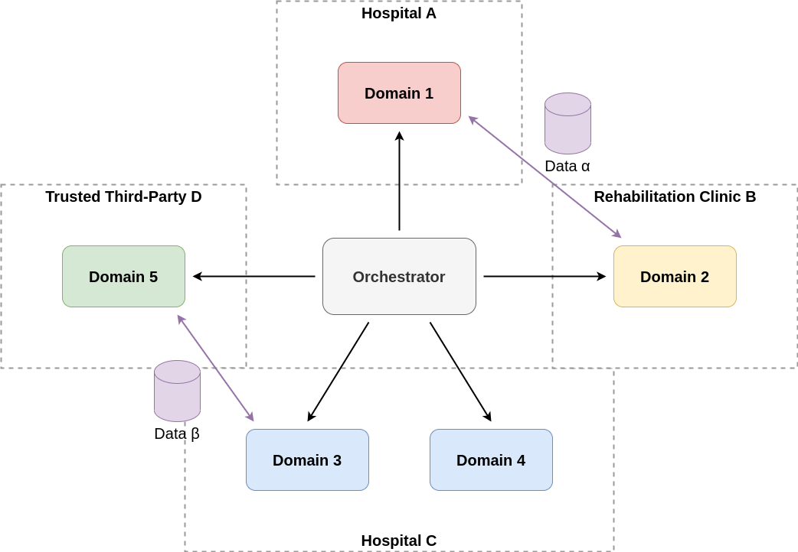
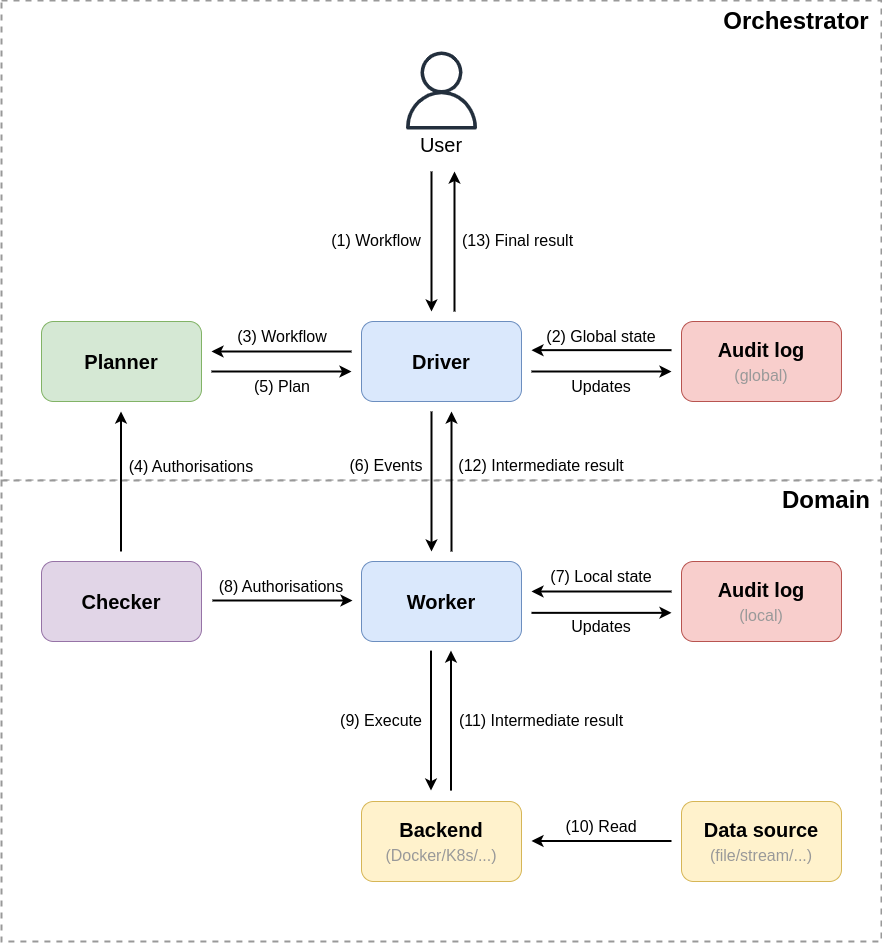
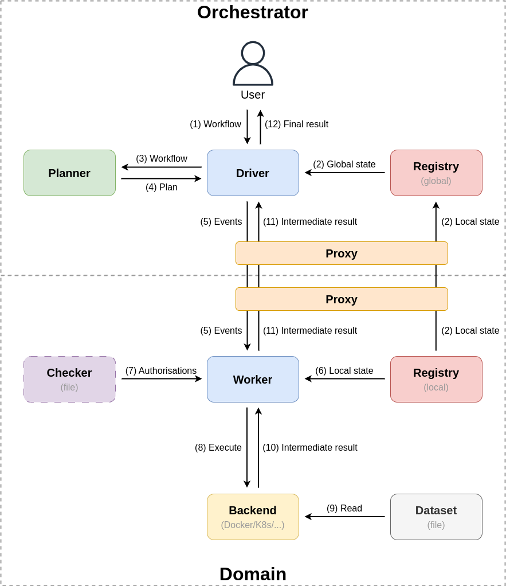

# Bird's-eye view
In this chapter, we provide a bird's-eye view of the framework. We introduce its centralised part (the orchestrator), decentralised part (a domain) and the components that each of them make up.

The components are introduced in more detail in [their respective chapters](./components/overview.md) (see the sidebar to the left). Here, we just globally specify what they do to understand the overarching picture.

Finally, note that the discussion in this chapter is on the _current_ implementation, as given in the framework [repository](https://github.com/epi-project/brane). Future work is discussed in [its own series of chapters](../future/introduction.md), which is a recommended read for anyone trying to do things like bringing Brane in production.

## The task at hand
As described in the [Design requirements](../requirements/introduction.md), Brane is primarily designed for processing data pipelines in an HPC setting. In Brane, these data pipelines are expressed as _workflows_, which can be thought of as high-level descriptions of a program or process where individual _tasks_ are composed into a certain control flow, linking inputs and outputs together. Specific details, such as where a task is executed or exploiting parallelism, is then (optionally) left to the runtime (Brane, in this case) to deduce automatically.

A workflow is typically represented as a graph, where nodes indicate tasks and edges indicate some kind of dependency. For Brane, this dependency is data dependencies. An example of such a graph can be found in **Figure 1**.

  
_**Figure 1**: An example workflow graph. The node indicate a particular function, where the arrows indicate how data flows through them (i.e., it specifies data dependencies). Some nodes (`i` in this example), may influence the control flow dynamically to introduce branches or loops._

At runtime, Brane will first _plan_ the workflow to resolve missing runtime information (e.g., which task is executed where). Then, it starts to traverse the workflow, executing each task as it encounters them until the end of the workflow is reached.

The tasks, in turn, can be defined separately as some kind of executable unit. For example, these may be executable files or containers that can be send to a domain and executed on their compute infrastructure. This split in being able to define workflows separately from tasks aligns well with Brane's objective of separating the concerns ([Assumption B3](../requirements/requirements.md#assumption-b3)) between the scientists and software engineers.

## A federated framework
  
_**Figure 2**: An overview of the framework services and how information flows between them. The Brane orchestrator communicates with domains to have them execute jobs or transfer data. Every domain can be thought of as one organisation, but not necessarily distinct (e.g., Hospital C has multiple domains)._

Brane is a federated framework, with a centralised orchestrator that manages the work that decentralised domains perform (see **Figure 2**). This orchestrator does so by sending _control messages_ to various domains, which encodes requests to perform a task on a certain data or exchange certain data with other domains. Importantly, these control messages only contain _data metadata_, which is assumed to be non-sensitive ([Assumption B5](../requirements/requirements.md#assumption-b5)); the actually sensitive contents of the data is only exchanged between domains when the domains decide to do so.

In this design, in accordance with [Requirement B1](../requirements/requirements.md#requirement-b1), Brane does not attempt to control the domains themselves. Instead, it defines the orchestrator and what kind of behaviour the domain should display if it's well-behaved. However, because of the autonomy of the domains, no guarantees can be made about whether the domains are _actually_ well-behaved; and as such, Brane is designed to allow well-behaving domains to deal with misbehaving domains.

## The components of Brane
The Brane framework is defined in terms of _components_, each of which has separate responsibilities in achieving the functionality of the framework as a whole. They could be thought of as services, but components are more high-level; in practise, a component can be implemented by many services, or a single service may implement multiple components.

Because Brane is federated, the components are grouped similarly. There are _central components_, which live in the orchestrator and work on processing workflows and emitting (compute) events; and there are _local components_ that live in each domain and work on processing the emitted events.

An overview of the components can be found in **Figure 3**.

  
_**Figure 3**: An overview of Brane's components, separated in the central plane (the orchestrator) and the local plane (the domains). Each node represents a component, and each arrow some high-level interaction between them, where the direction indicates the main information flow. The annotation of the arrows give a hint as to what is exchanged and in what order. Finally, the colours of the nodes indicate a flexible notion of similarity._

### Central components
The following components are defined at the central orchestrator:
- The _driver_ acts as both the entrypoint to the framework from a user's perspective, and as the main engine driving the framework operations. Specifically, it takes a workflow and traverses it to emit a series of events that need to be executed by, or otherwise processed on, the domains.
- The _planner_ takes a workflow submitted by the user and attempts to resolve any missing information needed for execution. Most notably, this includes assigning tasks to domains that should execute them and input to domains that should provide them. However, this can also include translating internal representations or adding additional security. Finally, the planner is also the first step where policies are consulted.
- The _global audit log_ keeps track of the global state of the system, and can be inspected both by global components and local components (the latter is not depicted in the figure for brevity).
- The _proxy_ acts as a gateway for traffic entering or leaving the node. It is more clever than a simple network proxy, though, as it may also enforce security, such as client authentication, and acts as a hook for sending traffic through [Bridging Function Chains](https://github.com/epi-project/EPIF-Configurations).

### Local components
Next, we introduce the components found on every Brane domain. Two types of components exist: Brane components and third-party components.

First, we list the Brane components:
- The _worker_ acts as a local counterpart to the global driver. It takes events emitted by the driver and attempts to execute them locally. An important function of the worker is to consult various checkers to ensure that what it does it in line with domain restrictions on data usage.
- The _checker_ is the decision point where a domain can express restrictions on what happens to data they own. At the least, because of [Assumption B4](/specification/requirements/requirements.md#assumption-b4), the checker enforces its own worker's behaviour; but if other domains are well-behaved, the checker gets to enforce their workers too. As such, the checker must also reason about which domains it expects to act in a well-behaved manner and thus allow them to access its data.
- The _local audit log_ acts as the local counterpart of the global audit log. As the global log keeps track of the global state, the local log keeps track of local state; and together, they can provide a complete overview of the entire system.
- The _proxy_ acts as a gateway for traffic entering or leaving the node. It is more clever than a simple network proxy, though, as it may also enforce security, such as client authentication, and acts as a hook for sending traffic through [Bridging Function Chains](https://github.com/epi-project/EPIF-Configurations).

The third-party components:
- The _backend_ is the compute infrastructure that can actually execute tasks and process datasets. Conceptually, every domain only has one, although in practise it depends on the implementation of the worker. However, they are all grouped as one location as far as the planner is concerned.
- The _data sources_ are machines or other sources that provide the actual data on which the tasks are executed. Their access is mostly governed by checkers, and they can supply data in many forms. From a conceptual point of view, every data source is a dataset, which can be given as input to a task - or gets created when a task completes to represent an output.

## Implementing components
In the [reference implementation](https://github.com/epi-project/brane), the components discussed in the [previous section](#the-components-of-brane) are implemented by actual services. These really are concrete programs that may run on a set of hosts to implement the functionality of the Brane framework.

  
_**Figure 4**: An overview of Brane's services as currently implemented. Every node now represents a service, at the identical location as the component they implement but with the name used in the repository. Otherwise, the figure can be read the same way as Figure 3._

Figure 4 shows a similar overview as Figure 3, but then for the concrete implementation instead of the abstract components. Important differences are:
- Checkers are purely virtual, and implemented as a static file describing the policies.
- Planners do not consult the domain checker files, but instead create plans without knowledge of the policies. Instead, the planner relies on workers refusing to execute unauthorised plans.
- The audit logs are simplified as _registries_, of which the global one (`brane-api`) mirrors the local ones (`brane-reg`) for most information.
- Data is only available as files or directories, not as generic data sources.

## Next
The remainder of this series of chapters will mostly discuss the functionality of the reference implementation. To start with, head over to the description of the individual [services](./services/overview.md), or skip ahead to which [protocols](TODO) they implement.

After this, the [specification](../spec/introduction.md) defines how the various components can talk to each other in terms such that new services implementing the components may be created. Then, in the [Future work](../future/introduction.md) series of chapters, we discuss how the reference implementation can be improved upon to reflect the component more accurately and practically.

Aside from that, you can also learn more about the [context of Brane](../requirements/introduction.md) or its custom Domain-Specific Language, [BraneScript](../appendix/languages/bscript/introduction.md).
