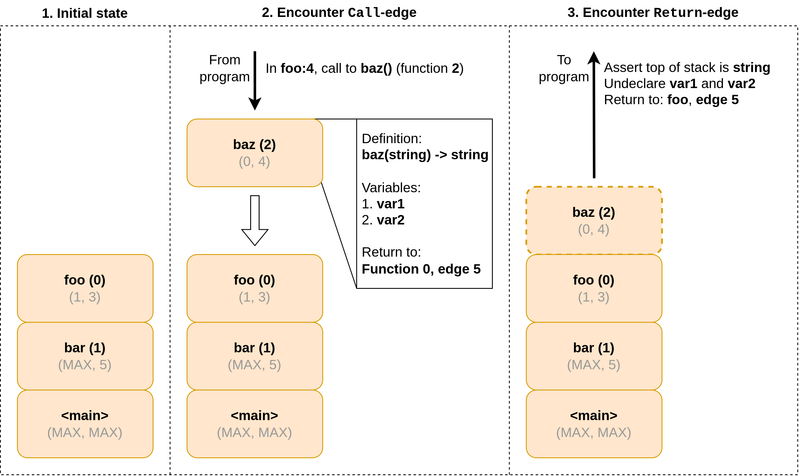

# Frame stack
_ [`FrameStack`](https://wiki.enablingpersonalizedinterventions.nl/docs/brane_exe/frame_stack/struct.FrameStack.html) in [`brane-exe/frame_stack.rs`](https://wiki.enablingpersonalizedinterventions.nl/docs/src/brane_exe/frame_stack.rs.html#70-75)._

In the previous chapters, the [expression stack](./stack.md) and the [variable register](./var_reg.md) were introduced. In this chapter, we will introduce the final state component of the VM: the frame stack. After this, we have enough knowledge to examine a full VM execution in the [final chapter](./showcase.md) of this series.

The frame stack is a FIFO-queue, like the expression stack. However, where the expression stack acts as a scratchpad memory for computations, the frame stack's utility lies with function calls, and keeps track of which calls have been made and -more importantly- where to return to when a [`Return`-edge](../../spec/wir/graph.md#return) is encountered. Finally, the frame stack also keeps track of the function return type (if known) for an extra type check upon returning from a function.

## Implementation
The frame stack is implemented as a queue of _frames_, which each contain information about the context of a function call. In particular, frames store three things:
1. A reference to the [function definition](../../spec/wir/schema.md#the-functiondef) (in the workflow's [definition table](../../spec/wir/schema.md#the-symtable)) of the called function;
2. A list of variables (as references to [variable definitions](../../spec/wir/schema.md#the-vardef) in the definition table) that are scoped to this function. When the function returns, these variables will be undeclared; and
3. A pointer to the edge to execute after the function in question returns. Note that this points to the next edge **to execute**, i.e., the edge after the call itself.

Other than that, the frame stack pretty much acts as a stack for calls. A visualisation of this process is given in Figure 1.

  
_**Figure 1**: Visualisation of the frame stack operations. Elements on the stack (frames) are pushed for every call and popped for every return. Frames describe the behaviour of return in terms of return type, variable undeclaration and which address to return to. Note the address returns to the edge **after** the call, not the call itself._

### Typing scopes
In Brane versions 3.0.0 and earlier, the frame stack had the secondary goal of maintaining which definitions were currently in scope. In particular, 

## Next
>  This section will be written soon.

