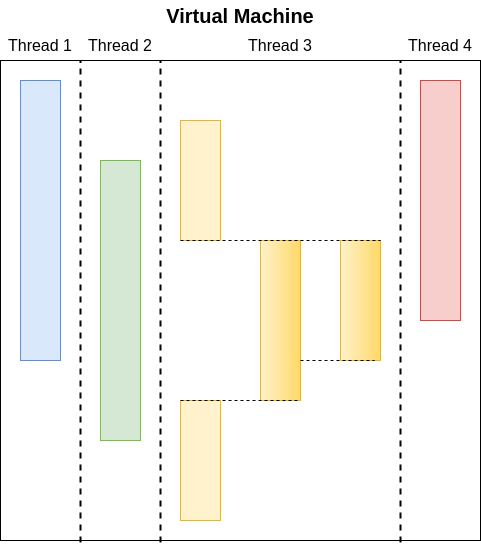

# Overview
In this chapter, we discuss the main operations of the Brane VM.

Note that we mostly focus on the global operations, and not on how specific [`Edge`](../../spec/wir/graph.md#edges)s or [`EdgeInstr`](../../spec/wir/instructions.md#edgeinstrs)uctions of the [WIR](../../spec/wir/introduction.md) are executed. Those are implemented as discussed in the WIR specification (mostly).

## Running threads
In its core, the VM is build as a request processing system, since that is the main functionality of the [`brane-drv`](../services/brane-drv.md): workflows come in as disjoint requests that can be processed separately and in parallel.

As such, the VM has to balance multiple _threads_ of execution. Each of these represent a single workflow or, more low-level, a single graph of edges that the VM has to traverse. However, these threads are completely isolated from each other; it is assumed that they do not interfere with each other during execution. This is made possible by considering datasets to be immutable[^not_very_immutable].

Practically, the threads of the VM are executed as [Rust Futures](https://www.viget.com/articles/understanding-futures-in-rust-part-1/) (roughly analogous to [JavaScript Promises](https://developer.mozilla.org/en-US/docs/Web/JavaScript/Reference/Global_Objects/Promise)). This means that no explicit management of threads is found back in the codebase, or indeed in the rest of the description of the VM (parallel-statements excempted). Instead, they are handled implicitly by virtue of multiple requests coming in in parallel.

Every thread, then, acts as a single-minded VM executing only a single workflow. This representation is visualized in Figure 1.

  
_**Figure 1**: Visualisation of the Virtual Machine and its threads. The VM executes multiple threads in parallel, each originating from its own workflow. Threads themselves then unspool a workflow into a series of events, such as giving feedback to the user or executing tasks. Sometimes, threads may also be spawned as the result of a fork (e.g., parallel statements; thread 3)._

[^not_very_immutable]: Practically, however, datasets aren't completely immutable because their identifier can be re-bound to a new version of it. That way, threads _can_ interfere with each other by re-assigning the identifier as another thread wants to use it. This is not fixed in the reference implementation.

## Unspooling workflows
Threads process workflows as graphs. Given one (or given a sub-part of the workflow, as in the case of fork), they traverse the graph as dictated by its structure. Because workflows can be derived from scripting-like languages, the traversing can include dynamic control flow decisions. To this end, a [stack](./stack.md) is used to represent the dynamic state, as well as a [variable register](./var_reg.md), to emulate variables, and a [frame stack](./frame_stack.md), to support an equivalent of function calls.

As the workflow gets traversed, threads encounter certain nodes that require emitting certain events; this are first emitted internally to be caught by the chosen [plugin](#vm-plugins). Then, the plugin re-emits them for correct processing: for example, this can be emitted as a print-statement for the user or as a task execution on a certain domain.

How the workflow is traversed exactly is described in the [WIR](../../spec/wir/introduction.md) specification.

## VM plugins
As mentioned in the [previous chapter](./introduction.md), does the VM rely on _plugins_ to change how it emits events that occur as the workflow is processed. These plugins change, for example, how a task is scheduled; in the local case, it is simply pushed to the local container daemon, whereas in the global case, it is sent as a request to the domain in question.

The plugins are implemented through a [Rust trait](https://doc.rust-lang.org/book/ch10-02-traits.html) (i.e., an interface). Then, which plugin is used can be changed statically by assigning a different type to the VM when it is instantiated; the compiler will then take care to generate a version of the VM that uses the given plugin. Because this is done statically, it is very performant but not very flexible (i.e., plugins cannot be changed at runtime, only at compile time).

## Next
With this overview in mind, we will next examine the [expression stack](./stack.md), before continuing with the [variable register](./var_reg.md) and [frame stack](./frame_stack.md).

You can also select another topic in the sidebar on the left.
