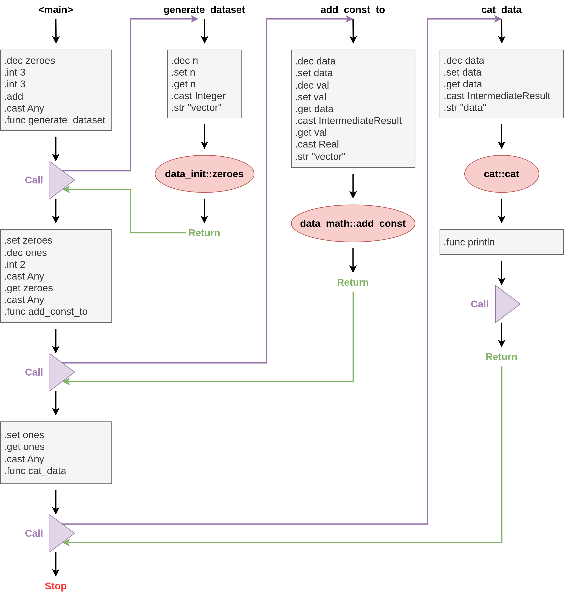

# Bringing it together - Workflow example
This page contains the workflow used in the [Bringing it together](./showcase.md) chapter.

Three representations are given: [BraneScript](../../appendix/languages/bscript/introduction.md), [WIR](../../spec/wir/introduction.md) (using a more readable syntax than JSON) and a visual graph representation.


## BraneScript
The snippet in Listing 1 shows the example workflow described using BraneScript.

```bscript
// See https://github.com/epi-project/brane-std
import cat;             // Provides `cat()`
import data_init;       // Provides `zeroes()`
import data_math;       // Provides `add_const()`


// Function to generate a dataset that is a "vector" of `n` zeroes
func generate_dataset(n) {
    return zeroes(n, "vector");
}

// Function to add some constant to a dataset
func add_const_to(val, data) {
    return add_const(data, val, "vector");
}

// Function to print a dataset
func cat_data(data) {
    println(cat(data, "data"));
}


// Run the script
let zeroes := generate_dataset(3 + 3);
let ones := add_const_to(2, zeroes);
cat_data(ones);
```
_**Listing 1**: The example workflow for the [Bringing it together](./showcase.md) chapter. It is denoted in [BraneScript](../../appendix/languages/bscript/introduction.md)._


## WIR
The snippet in Listing 2 shows the equivalent WIR to the workflow given in Listing 1.

```wir
Table {
    Variables [
        0: n (Any),
        1: val (Any),
        2: data (Any),
        3: data (Any),
        4: zeroes (IntermediateResult),
        5: ones (IntermediateResult),
    ],
    Functions [
        0: print(String),
        1: println(String),
        2: len(...),
        3: commit_result(...),
        4: generate_dataset(Any) -> IntermediateResult,
        5: add_const_to(Any, Any) -> IntermediateResult,
        6: cat_data(Any),
    ],
    Tasks [
        0: cat<1.0.0>::cat_range_base64(...),
        1: cat<1.0.0>::cat_range(...),
        2: cat<1.0.0>::cat(IntermediateResult, String) -> String,
        3: cat<1.0.0>::cat_base64(...),
        4: data_init<1.0.0>::zeroes(Integer, String) -> IntermediateResult,
        5: data_math<1.0.0>::add_const(IntermediateResult, Real, String) -> IntermediateResult,
    ],
    Classes [
        0: Data { name: String },
        1: IntermediateResult { .. },
    ]
}

Workflow [
    <main> [
        Linear [
            .dec zeroes
            .int 3
            .int 3
            .add
            .func generate_dataset
        ],
        Call,
        Linear [
            .set zeroes
            .dec ones
            .int 2
            .get zeroes
            .func add_const_to
        ],
        Call,
        Linear [
            .set ones
            .get ones
            .func cat_data
        ],
        Call,
        Stop
    ],

    func 4 (generate_dataset) [
        Linear [
            .dec n
            .set n
            .get n
            .cast Integer
            .str "vector"
        ],
        Node<4> (data_init<1.0.0>::zeroes),
        Return
    ],

    func 5 (add_const_to) [
        Linear [
            .dec data
            .set data
            .dec val
            .set val
            .get data
            .cast IntermediateResult
            .get val
            .cast Real
            .str "vector"
        ],
        Node<5> (data_math<1.0.0>::add_const),
        Return
    ],

    func 6 (cat_data) [
        Linear [
            .dec data
            .set data
            .get data
            .cast IntermediateResult
            .str "data"
        ],
        Node<2> (cat<1.0.0>::cat),
        Linear [
            .func println,
        ],
        Call,
        Return
    ],
]
```
_**Listing 2**: A [WIR](../../spec/wir/introduction.md)-representation of the workflow given in Listing 1. This snippet uses freeform syntax to be more readable than the WIR's JSON._


## Graph
Figure 1 shows the visual representation of the workflow given in Listing 1 and Listing 2.


_**Figure 1**: Visual representation of the example workflow for the [Bringing it together](./showcase.md) chapter. The workflow is described as a [WIR](../../spec/wir/introduction.md)-workflow, using WIR-graph elements and instructions._
