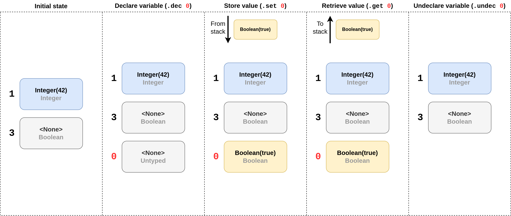

# Variable register
_ [`VariableRegister`](/l) in [`brane-exe/varreg.rs`](/docs/src/brane_exe/varreg.rs.html#27-30)._/

In the [previous chapter](./stack.md), we introduced the expression stack as a scratchpad memory for computing expressions as a thread of the VM executes a workflow. However, this isn't always suitable for all purposes. Most notably, the stack only allows operations on the top values; this means that if we want to re-use arbitrary values from before, this cannot be represented by the stack alone.

To this end, a _variable register_ is implemented in the VM that can be used to temporarily store values on another location outside of the stack altogether. Then, the values in these variables can be pushed to the stack whenever they're required.

## Implementation
The variable register is implemented as an unordered map of variable identifiers to [values](./stack.md#values-and-fullvalues). Like values, the variable register does not store variables by name but rather by definition, as found in the workflow's [definition table](../../spec/wir/schema.md#the-symtable). As such, the map is keyed by numbers indexing the table instead of its name. The definition in the definition table, then, defines the variable's name and type.

The variables in the register can have one of three states:
1. **Undeclared**: the variable does not appear in the register at all;
2. **Declared but uninitialized**: the variable appears in the register but have a null-value (Rust's [`None`](https://doc.rust-lang.org/std/option/enum.Option.html#variant.None)-value); or
3. **Initialized**: the variable appears in the register and has an actualy value.

The reason for this is that variables are typed, and that they cannot change type. In most cases, variables will have their types annotated in their definition; but sometimes, if this cannot be determined statically, then a variable will assume the type of the first value its given _until_ it is undeclared and re-declared again.

  
_**Figure 1**: Visualisation of the possible variable register operations. Variables are stored by ID, and can either have a value or `<None>` to represent uninitialized. When a new variable is declared, the ID is looked up in the workflow [definition table](../../spec/wir/schema.md#the-symtable), and the slot is typed according to the variable's static type. Otherwise, (as is the case for 0), the type is set when the variable is initialized. Further operations must always use that type until the variable is undeclared and re-declared._

## Next
The next chapter will see the discussion of the [frame stack](./frame_stack.md), the final of the VM's state-components. In the [chapter after it](./showcase.md), we will showcase how the components operate together when executing a simple workflow.

For an overview of the VM as a whole, check the [first chapter](./overview.md) in this series. You can also select a different topic altogether in the sidebar to the left.
