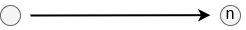
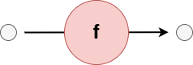
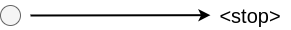
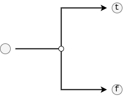
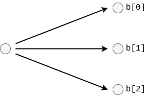
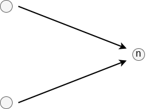
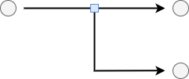

# Layer 1: The graph
In this chapter, we specify how the part of the WIR looks like that specifies the high-level workflow graph.

The toplevel of the WIR itself, which mostly concerns itself with definitions, can be found in the [previous chapter](./schema.md). By contrast, the [next chapter](./instructions.md) defines the lower-level instructions that are used within edges of the graph.

We use the same [conventions](./schema.md#conventions) as in the previous chapter. We recommend you read them before continuing to understand what we wrote down.


## Edges
Graphs in the WIR are built of segments called `Edge`s. This is a misnamed term, because this represents both edges and nodes in the graph. The underlying idea, however, is that the graph is build up of edges of pre-defined shapes, like linear connectors, branches or loops, some of which happen to have a node attached to them.

The possible edge types are defined in the next few subsections. For every edge type, we will show an abstract representation of that edge. Here, the greyed-out, small spheres act as connectors that may be connected to connectors of other edges to build complex graph structures.

Specification-wise, all `Edge` variants have the following fields in common:
- `kind` (string): Denotes which variant of the `Edge` this object describes. The identifiers used are given below in each subsections.

### Linear


_Identifier: `"lin"`_

The `Linear` edge is arguably the simplest edge. It simply connects to a single previous edge, and a single next edge. However, it is the only type of edge that can have arbitrary [`EdgeInstr`](TODO)uctions attached to it that manipulate the stack before the edge is traversed.

Concretely, a linear edge has the following fields:
- `i` (Array\<[`EdgeInstr`](TODO)\>): A sequence of instructions to execute before traversing the edge.
- `n` (number): The index of the next edge to traverse.

The following is an example of a `Linear` edge:
```json
TODO
```

### Node


_Identifier: `"nod"`_

A `Node` edge is comparable to a `Linear` edge except that it executes a task instead of stack instructions. It connects a single previous edge to another next edge.

It has the following fields:
- `t` (number): The identifier of the task's definition in the parent [`SymTable`](./schema.md#the-symtable).
- `l` ([`Locations`](#the-locations)): Denotes where this task may be executed from the user's perspective (i.e., restricts planning).
- `s` (string?): Denotes where this task will actually be executed. If `null`, then the planner failed and no possible location is found. Populated by the planner.
- `i` (Object\<string, [`AvailabilityKind`](#the-availabilitykind)?\>): A map of data/intermediate results identifiers to how they can be accessed (i.e., either where to find it locally or where to transfer it from). Note that the keys are serialized [`DataName`](#the-dataname) objects. This effectively denotes the data used as input for this task.
- `r` (string?): The identifier of the intermediate result produced by this task (or `null` if it does not produce any).
- `n` (number): The index of the next edge to traverse.

Example `Node` edge:
```json
// Example Node edge that is unplanned
{
    "kind": "nod",
    "t": 5,
    "l": "all",
    "s": null,
    "i": {
        "{\"Data\":\"data_A\"}": null
        "{\"IntermediateResult\":\"result_foo\"}": null
    },
    "r": "result_bar",
    "n": 42
}
```
```json
// Example Node edge that is planned
{
    "kind": "nod",
    "t": 5,
    "l": "all",
    "s": "hospital_A",
    "i": {
        "{\"Data\":\"data_A\"}": {
            "kind": "available",
            "how": {
                "file": {
                    "path": "/data/data_A.txt"
                }
            }
        },
        "{\"IntermediateResult\":\"result_foo\"}": {
            "kind": "unavailable",
            "how": {
                "transferregistrytar": {
                    "location": "hospital_B",
                    "address": "https://hospital_B.com/results/download/result_foo"
                }
            }
        }
    },
    "r": "result_bar",
    "n": 42
}
```

### Stop


_Identifier: `"stp"`_

The `Stop` edge acts as the end of a workflow. The executing engine will stop traversing the graph as soon as this edge is traversed.

As such, the `Stop`-edge has no fields.

Example stop edge:
```json
{
    "kind": "stp"
}
```

### Branch


_Identifier: `"brc"`_

The `Branch` edge implements a conditional control flow branch. Based on the top value on the stack when this edge is traversed, one of either edges will be traversed next. As such, the top value should be a boolean and prepared by a [`Linear`](#linear) edge preceding this branch.

The fields that exist in the `Branch`:
- `t` (number): The index of the edge to traverse if the top value on the stack is true.
- `f` (number?): The index of the edge to traverse if the top value on the stack is false. This value can be `null` if the user has a conditional branch with only a true-body. If so, then the edge denoted by the `m`-field is executed when the top value is false.
- `m` (number?): The index of the edge where the true and false branches come together. This is useful for analysing the graph, as it allows one to skip the branch without recursing into it. Importantly, the merge edge is also used when the user did not define an `f`-branch. This value can only be `null` if there is a true- and false-branch, and both fully return (i.e., end in a [`Stop`](#stop) edge).

An example `Branch`:
```json
// An example branch that has a true and a false statement
{
    "kind": "brc",
    "t": 42,
    "f": 52,
    "m": 62
}
```
```json
// An example branch that only has a true statement
{
    "kind": "brc",
    "t": 42,
    "f": null,
    "m": 62
}
```
```json
// An example branch that has fully returning true- and false branches
{
    "kind": "brc",
    "t": 42,
    "f": 52,
    "m": null
}
```

### Parallel


_Identifier: `"par"`_

`Parallel` edges are similar to branches in that they split a single sequence of edges into multiple. However, where a `Branch` forces a decision between one of the two sequences, the `Parallel`-edge denotes that the two (or more) can be taken simultaneously.

The counterpart of the `Parallel`-edge is the [`Join`](#join)-edge, which marks where the parallel branches come together. The exact behaviour of this process is described when talking about the execution engine in the [`brane-drv`](TODO) service.

The `Parallel` edge has the following branches:
- `b` (Array\<number\>): A list of indices pointing to the first edges in the branches.
- `m` (number): The index of the [`Join`](#join)-edge marking the end of this parallel branch. This is here to make analysing the graph easier and skipping the parallel without recursing into it.

An example of a parallel edge is:
```json
// A parallel edge with two branches
{
    "kind": "par",
    "b": [ 42, 52 ],
    "m": 62
}
```

### Join


_Identifier: `"join"`_

The `Join`-edge is the counterpart to the [`Parallel`](#parallel)-edge. Where the latter forks the sequence of edges into multiple edges that can be executed concurrently, the `Join` reverses this process and merges the forked sequences back to one. The exact behaviour of this process is described when talking about the execution engine in the [`brane-drv`](TODO) service.

It has the following fields:
- `m` ([`MergeStrategy`](#the-mergestrategy)): Configures the behaviour of the join. In particular, states how to wait for the branches (if needed) and how to combine their resulting values.
- `n` (number): The index of the next edge to traverse.

The example of a `Join`-edge:
```json
{
    "kind": "join",
    "m": "Sum",
    "n": 42
}
```

### Loop


_Identifier: `"loop"`_

The `Loop`-edge connects to one sequence of edges that are taken repeatedly, and one sequence of edges that is taken once the condition completes.

Because the `Loop` is conditional, it depends on the top value on the stack every time at the start of a new iteration. In particular, this must be a boolean value, and the iteration is taken if it is true, and the next edge is taken if the value is false. Clearly, the loop body is allowed to manipulate the top of the stack in between checks.

The following fields are used in a `Loop`:
- `c` (number): Defines the index of the first edge of a series that computes the condition at the start of every iteration.
- `b` (number): Defines the index of the first edge of a series that implements the body of the loop. These are the edges that are taken repeatedly as long as the edges of `c` compute true.
- `n` (number): The index of the next edge to traverse once the edges of `c` compute false.

An example `Loop`-edge is:
```json
{
    "kind": "loop",
    "c": 42,
    "b": 52,
    "n": 62
}
```

### Call


_Identifier: `"cll"`_

The `Call`-edge implements a call to another workflow snippet as if it were a function. In particular, before the next edge is traversed, a series of edges are executed until a `Return`-edge is traversed. This then unwinds the stack back to the point of the `Call`, possibly pushing a result of the function on there before continuing.

This edge thus behaves similarly to a [`Node`](#node)-edge from the graph perspective, except that it calls other edges instead of a task container. Another difference is that the call does not inherently encode the function to call; instead, this is represented as a value on the stack and may thus differ dynamically to perform virtual function calls (although the rest of the language does not support this, currently).

The following fields make a `Call`:
- `n` (number): The index of the next edge to traverse once the function body returns.

An example:
```json
{
    "kind": "cll",
    "n": 42
}
```

### Return


_Identifier: `"ret"`_

Counterpart to the [`Call`](#call)-edge, the `Return`-edge marks the end of a function body. Doing so unwinds the stack until the state of the most recent [`Call`](#call), and possibly pushes the top value of the stack before unwinding after it's done (this emulates function return values).

The `Return` does not have any fields, since its behaviour is defined solely based on the stack and its frames.

Example `Return`:
```json
{
    "kind": "ret"
}
```


## Miscellaneous
### The Locations
The `Locations` object denotes possible locations given by a user for planning a task. Specifically, it has two variants: `All`, which means that no restriction is applied, or `Restricted` which defines a whitelist of allowed locations.

This schema can be one of either two things:
- It can be a string `"all"` which denotes the first variant; or
- It can be an Object with a key `"restricted"` mapping to an Array\<string\> of location identifiers where the task is allowed.

Example `Locations` are:
```json
// First variant
"all"
```
```json
// Second variant, allowed nowhere
{
    "restricted": []
}
```
```json
// Second variant, allowed only at a limited set
{
    "restricted": [ "hospital_A", "clinic_B" ]
}
```

### The DataName
`DataName`s are objects that denote either the name of a Dataset or of an IntermediateResult.

As such, they are objects with exactly one of the following two fields:
- `Data` (string): States the identifier of the dataset, and marks this as a Data by virtue of this field being present.
- `IntermediateResult` (string): States the identifier of the result, and marks this as an IntermediateResult by virtue of this field being present.

For example:
```json
// A Data called `A`
{
    "Data": "A"
}
```
```json
// An IntermediateResult called 'result_B'
{
    "IntermediateResult": "result_B"
}
```

### The AvailabilityKind
An `AvailabilityKind` denotes how to get access to a particular dataset.

It has two variants: the `Available`-kind denotes that a domain has access to that dataset, and describes where it can find its own dataset. The `Unavailable`-variant instead describes which domain has access to the dataset and how to request that domain to download it.

The following fields are present for both variants:
- `kind` (string): Denotes which variant this is. If it's `"available"`, then the rest is of the `Available`-variant; otherwise, if it's `"unavailable"`, then the rest is of the `Unavailable`-variant.

The `Available`-variant has the following additional fields:
- `h` ([`AccessKind`](#the-accesskind)): Describes how to access the dataset for execution.

In contrast, the `Unavailable`-variant contains the following field:
- `h` ([`PreprocessKind`](#the-preprocesskind)): Describes how to access a dataset for transferring.

For example:
```json
// Available
{
    "kind": "available",
    "how": {
        "file": {
            "path": "/data/data_A.txt"
        }
    }
}
```
```json
// Unavailable
{
    "kind": "unavailable",
    "how": {
        "transferregistrytar": {
            "location": "hospital_B",
            "address": "https://hospital_B.com/results/download/result_foo"
        }
    }
}
```

### The AccessKind
The `AccessKind` describes how a file can be accessed on the domain that uses it for execution. While it may have more variants in the future, for now it only supports the `File`-variant, which denotes that the dataset is a file.

The `AccessKind` is given as an object who's key denotes its variant. For `File`, this is the `"file"`-identifier. The mapped object contains the fields for that variant.

The `File`-variant has the following fields:
- `path` (string): The path to the file to use.

For example:
```json
// A File variant
{
    "file": {
        "path": "/hello/world.txt"
    }
}
```

### The PreprocessKind
The `PreprocessKind` describes how to gain access to a file for domains that don't have access yet. For now, only one variant exists, which is the `TransferRegistryTar`-variant: this means that the domain can download the dataset as a compressed [tarball](https://en.wikipedia.org/wiki/Tar_(computing)) from a particular domain.

The `PreprocessKind` is given as an object who's key denotes its variant. For `TransferRegistryTar`, this is the `"transferregistrytar"`-identifier. The mapped object contains the fields for that variant.

The `TransferRegistryTar`-variant has the following fields:
- `location` (string): The identifier of the domain to download the file from.
- `address` (string): The URL to send the HTTP-request to download the dataset file from.

Examples:
```json
// A TransferRegistryTar variant
{
    "transferregistrytar": {
        "location": "hospital_A",
        "address": "https://hospital_a.com/data/download/dataset_A"
    }
}
```

### The MergeStrategy
The `MergeStrategy` describes different ways how a [`Join`](#join) can process the results of a [`Parallel`](#parallel) branch.

It is defined as a string with one of the following possible values:
- `"First"`: The result of the first branch that returns is used, the rest of the branches are terminated if they are still running.
- `"FirstBlocking"`: The result of the first branch that returns is used, but the execution engine waits until all branches have completed before continuing.
- `"Last"`: The result of the last branch that returns is used.
- `"Sum"`: The values of all branches are added together. Only works if the return values are numerical (or strings!).
- `"Product"`: The values of all branches are multiplied together. Only works if the return values are numerical.
- `"Max"`: The largest value of all return values is returned. Only works if the return values are numerical.
- `"Min"`: The smallest value of all return values is returned. Only works if the return values are numerical.
- `"All"`: All values of the branches are aggregated into an array of that type.
- `"None"`: The execution engine blocks until all branches have returned, but otherwise returns void.


## Next
In the [next chapter](./instructions.md), we define the final parts of the WIR: the instructions that manipulate the stack and that can be annotated on a [`Linear`](#linear)-edge. If you are reading the WIR bottom-up, you should instead proceed to the [previous chapter](./schema.md) where we define the toplevel of the WIR, which mostly relates to definitions and how edges are tied together.

Alternatively, you can select a different topic than the WIR altogether in the sidebar on the left.
