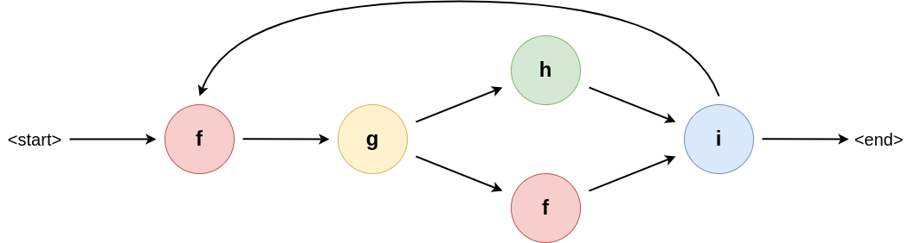
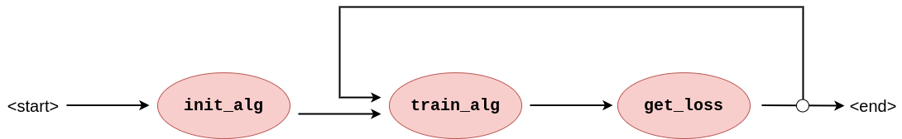
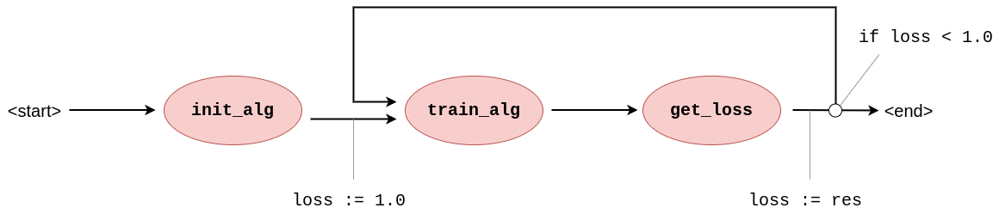
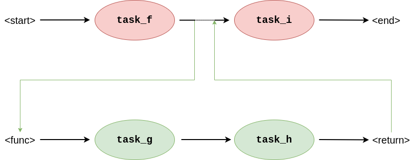

# Workflow Internal Representation
The Brane framework is designed to accept and run workflows, which are graph-like structures describing a particular set of tasks and how information flows between them. The Workflow Internal Representation (WIR) is the common representation that Brane receives from all its various frontends.

In these few chapters, the WIR is introduced and defined. For the remainder of this chapter, we will give context to the WIR about why it exists. In next chapters, we will then state its specification.


## Two levels of workflow
Typically, we think of a workflow as a graph-like structure that contains only essential information about how to execute the tasks. Figure 1 shows an example of such a graph.

  
_**Figure 1**: An example workflow graph. The node indicate a particular function, where the arrows indicate how data flows through them (i.e., it specifies data dependencies). Some nodes (`i` in this example), may influence the control flow dynamically to introduce branches or loops._

This is a very useful representation for policy interpretation, because policy tends to concern itself about data and how it flows. The typical workflow graph lends itself well to this kind of analysis, since reasoners can simply traverse the graph and analyse which task is executed where to see which sites may see their data or new datasets computed based on their data.

However, for Brane, this representation is incomplete. Due to its need to support [scripting-like workflow languages](../../appendix/languages/bscript/introduction.md), workflows have non-trivial control flow evaluation; for example, Brane workflows are not Directed A-cyclic Graphs (DAGs), since they may encode iterations, and control flow may depend on arbitrarily complex expressions defined only in the workflow file.

For example, if we take [BraneScript](../../appendix/languages/bscript/introduction.md) as the workflow language, the user might express an intuitive workflow as seen in Listing 1. This workflow runs a particular task (`train_alg()`) conditionally, based on some loss that it returns. This is a typical example of a task that needs to run until it converges.

```bscript
import ml_package;

let loss := 1.0;
let alg := init_alg();
while (loss < 1.0) {
    alg := train_alg(alg);
    loss := get_loss(alg);
}
```
_**Listing 1**: Example snippet of [BraneScript](../../appendix/languages/bscript/introduction.md) that shows a workflow with a conditional branch._

If we simply represent this as a graph of tasks with data-dependencies, the information on the condition part of the iteration gets lost: the graph does not tell us what to condition on or how to initialise the `loss`-variable (Figure 2). As such, the WIR has to represent also the control flow layer (Figure 3); and because this control flow can consist of multiple statements and arbitrarily complex expressions, this control flow layer needs describe a full layer of execution as well.

  
_**Figure 2**: Graph representation of Listing 1 showing only the high-level aspects typically found in workflows. With only this information, the condition of the loop is non-obvious, as are its starting conditions._

  
_**Figure 3**: Graph representation of Listing 1 including the control flow annotations on its edges. Now, the workflow contains information on how to check the condition and update it every iteration._

In Brane, the WIR thus balances the requirements of the two services that interact with it:
1. The [`brane-drv`](../../implementation/services/brane-drv.md)-service prefers to represent a workflow imperatively, with statements performing some work "in-driver" (i.e., control flow execution) and some work "in-task" (such that it can touch sensitive data).
2. The [checker](../../implementation/bird_eye.md#central-components)-service, on the other hand, needs to learn about data dependencies and how data moves from location to location.


## WIR to the rescue
As a solution to embed the two levels of execution, the WIR is structured very much like the graph in Figure 3.

At the toplevel, the WIR denotes a graph, where nodes represent task execution steps and edges represent transitions between them. To support parallel execution, branches, loops, etc, these edges can connect more than two nodes (or less, to represent start- or stop edges).

Then, these edges are annotated with _edge instructions_ that are byte-like instructions encoding the control flow execution required to make conditional decisions. They manipulate a stack, and this stack then serves as input to either certain types of edges (e.g., a branch) or to tasks to allow them to portray conditional behaviour as well.

### Functions
As an additional complexity, the WIR needs to have support for functions (since they are supported by [BraneScript](../../appendix/languages/bscript/introduction.md)). Besides saving executable size by re-using code at different places in the execution, functions also allow for the use of specialised programming paradigms like [recursion](https://en.wikipedia.org/wiki/Recursion). Thus, the graph structure of the WIR needs to have a similar concept.

Functions in the WIR work similarly to functions in a procedural language. They can be thought of as snippets of the graph that are kept separately and can then be called using a special type of edges that transitions to the snippet graph first before continuing with its actual connection. This process is visualised in Figure 4.

  
_**Figure 4**: Graphs showing a "graph call", which is how the WIR represents function call. The edge connecting `task_f` to `task_i` implements the call by first executing the snippet `task_g -> task_h` before continuing to its original destination._

To emulate the full statement function, the edge also transfers some of the stack elements in the calling graph to the stack frame of the snippet graph. This way, arguments can be passed from one part of the graph to another to change its control flow as expected.


## Next
In the [next chapter](./schema.md), we introduce the toplevel structure of the WIR and how it is generally encoded. Then, in the next two chapters, we introduce the schemas for the [graph structure](./graph.md), which can be thought of as the "higher-level layer" in the WIR, and the [instructions](./instructions.md), which can be thought of as the "lower-level layer" in the WIR.

If you are instead interested in how to execute a WIR-workflow, consult the documentation on the [`brane-drv`](../../implementation/services/brane-drv.md)-service. Analysing a WIR is for now done in the [`brane-plr`](../../implementation/services/brane-plr.md)-service only.
