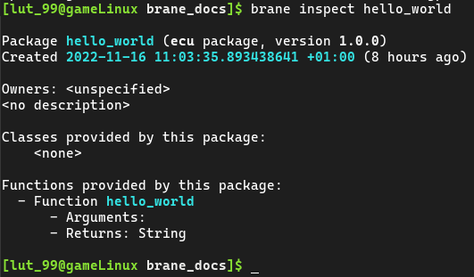

# Part 2: A workflow for Disaster Tweets
In this document, we detail the steps that can be taken during the second part of the tutorial. In this part, participants will write a larger workflow file for an already existing package and submit it to a running EPI Framework instance. The package implements a data pipeline for doing Natural Language Processing (NLP) on the [Disaster Tweets dataset](https://www.openml.org/search?type=data&status=active&id=43395&sort=runs), created for the matching [Kaggle challenge](https://www.kaggle.com/competitions/nlp-getting-started).


## Background
In the [first part](./p1_hello_world.md) of the tutorial, you've created your own Hello, world!-package. In this tutorial, we will assume a more complex package has already been created, and you will take on the role as a Domain-Specific Scientist who wants to use it in the framework.

The pipeline implements a classifier that aims to predict is a tweet is indicating a natural disaster is happening, or not. To do so, a naive bayes classifier has been implemented that takes preprocessed tweets as input, and outputs a `1` if it references a disaster, or a `0` if it does not. In addition, various visualisations have been implemented that can be used to analyse the model and the dataset.

The package has been implemented by Andrea Marino and Jingye Wang for the course [Web Services and Cloud-Based Systems](https://studiegids.uva.nl/xmlpages/page/2021-2022/zoek-vak/vak/89328). Their original code can be found [here](https://github.com/marinoandrea/disaster-tweets-brane), but we will be working with a version compatible with the most recent version of the framework which can be found [here](https://github.com/epi-project/brane-disaster-tweets-example).


## Objective
As already mentioned, this part focusses on implementing a workflow that can do classification on the disaster tweets dataset. To do so, the dataset has to be downloaded and the two packages have to be built. Then, a workflow should be written that does the following:
1. Clean the training and test datasets (`clean()`)
2. Tokenize the training and test datasets (`tokenize()`)
3. Remove stopwords from the tweets in both datasets (`remove_stopwords()`)
4. Vectorize the datasets (`create_vectors()`)
5. Train the model (`train_model()`)

All of these functions can be found in the `compute` package.

Then, optionally, any number of visualizations can be implemented as well to obtain results from the dataset and the model. Conveniently, you can generate all of them in a convenient HTML file by calling the `visualization_action()` function from the `visualization` package, but you can also generate the plots separately.

>  Tip: If you use `brane inspect <package>`, you can see the tasks defined in a package together with which input and output the tasks define. For example:
> 
> 


## Installation
Before you can begin writing your workflow, you should first built the packages and download the required datasets. We will treat both of these separately in this section.

We assume that you have already completed part 1. If not, [install the `brane` executable](./p1_hello_world.md#installation) and [install Docker](./p1_hello_world.md#building-a-package) as specified in the previous document before you continue.

### Building packages
Because the package is in a [GitHub](https://github.com) repository, this step is actually fairly easy by using the `brane import` command.

Open a terminal that has access to the `brane`-command, and then run:
```bash
brane import epi-project/brane-disaster-tweets-example -c packages/compute/container.yml
brane import epi-project/brane-disaster-tweets-example -c packages/visualization/container.yml
```

This will allow you to build a package's source from a repository of the user `epi-project` and that goes by the name of `brane-disaster-tweets-example`. An eagle-eyed person may notice that this is exactly the URL of a repository, except that `https://github.com/` is omitted. The second part of the command, `-c ...`, specifies which `container.yml` to use in that repository. We need to specify this because the repository defines two different packages, but this does allow us to build both of them.

After the command completes, you can verify that you have them installed by running `brane list` again.

### Obtaining data
In the EPI Framework, datasets are considered assets, much like packages. That means that similarly, we will have to get the data file(s), defined some metadata, and then use the `brane` tool to build the assets and make them available for local execution.

To save some time, we have already pre-packaged the training dataset [here](./data/train.zip), and the test dataset [here](./data/test.zip). These are both ZIP-archives containing a directory with a metadata file (`data.yml`) and another directory with the data in it (`data/train.csv` for the training dataset, and `data/test.csv` for the test dataset). Once downloaded, you should unpack them, and then open a terminal.

Navigate to the folder of the training dataset first, and then run this command:
```bash
brane data build ./data.yml
```
Once it completes, navigate to the directory of the second dataset and repeat the command. You can then use `brane data list` to assert they have been added successfully.

The `data.yml` file itself is relatively straightforward, and so we encourage you to take a look at it yourself. Similarly, also take a look at the dataset itself to see what the pipeline will be working on.

>  By default, the above command does not copy the dataset file referenced in `data.yml`, but instead just links it. This is usually file, but if you intend to delete the downloaded files immediately afterwards, use the `--no-links` flag to copy the dataset instead.


## 
