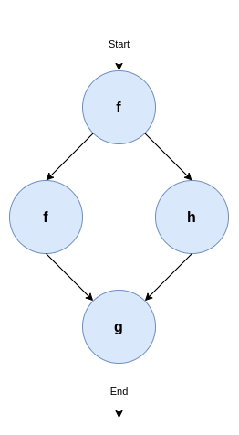

# Part 1: Hello, world!

>  This handout will be slightly updated before the tutorial.

In this document, we will detail the steps to take to write a simple package within the EPI Framework (also called the Brane Framework). Specifically, this tutorial will focus on how to install the CLI client (the `brane` executable), build a `hello_world` package and then call the `hello_world()` function within that package on a local machine. Finally, we will also practise submitting the code to a remote machine.


## Background
The framework revolves around _workflows_, which are high-level descriptions of an algorithm or data processing pipeline that the system will execute. Specifically, every workflow contains zero or more _tasks_, which are conceptual functions that take an in- and output, composed in a particular order or control flow. It helps to think of them as graphs, where the nodes are tasks that must be called, and the edges are some form of data flowing between them.

We could formalise a particular data pipeline as a workflow. For example, suppose we have the following steps:
> 1. Clean dataset
> 2. Set `loss` to 100
> 3. While `loss` < 0.1
>    1. Do forward pass
>    2. Compute loss and store in `loss`
>    3. Do backward pass using `loss` as input

We can then represent this as a workflow graph of tasks that indicates which tasks there are and how the data flows between them. This is visualised in Figure 1.

<p align="center">
    
</p>

_**Figure 1: A very simple workflow using three tasks, `f`, `g` and `h`.** The nodes represent a function call, whereas the edges represent some data dependency. Specifically, this workflow depicts `f` has to be run first, then a second call of `f` and a new call of `h` can run in parallel, after which a third function `g` must be called._

While workflows can be expressed in any kind of language, the EPI Framework features its own Domain-Specific Language (DSL) to do so, called BraneScript[^bscript]. This language is very script-like, which allows us to think of tasks as a special kind of function. Any control flow (i.e., dependencies between tasks) is then given using variables and commonly used structures, such as if-statements, for-loops, while-loops, and less commonly used structures, such as on-structs or parallel-statements.


## Objective
In this tutorial, we will mainly focus on creating a single task to execute. Traditionally, this task will be called `hello_world()`, and will return a string `"Hello, world!"` once it is called. To illustrate, the following [Python](https://python.org) snippet implements the logic of the task:
```python
def hello_world():
	return "Hello, world!"
```

By using `print(hello_world())`, we can print `Hello, world!` to the terminal. In the EPI Framework, we will implement the function as a task, and then write a very simple workflow that implements the print-part.

[^bscript]: There is a second DSL, Bakery, which is more unique to the framework and features a natural language-like syntax. However, this language is still in development, and so we focus on BraneScript.


## Installation
To start, first download the `brane` executable from the [repository](https://github.com/epi-project/brane/releases/v2.0.0). This is a command line-based client for the framework, providinh a wide range of tools to use to develop packages and workflows for the EPI Framework. We will use it to build and then test a _package_, which can contain one or more tasks. Since we are only creating the `hello_world()` task, our package (called `hello_world`) will contain only one task.

The executable is pre-compiled for Windows, macOS (Intel and M1/M2) and Linux. The binaries in the repository follow the pattern of `<name>-<os>-<arch>`, where `<name>` is the name of the executable (`brane` for us), `<os>` is an identifier representing the target OS (`windows` for Windows, `darwin` for macOS and `linux` for Linux), and `<arch>` is the target processor architecture (`x86_64`, typically, or `aarch64` for M1/M2 Macs).

So, for example, download `brane-windows-x86_64` if you are on Windows, or `brane-darwin-aarch64` if you have an M1/M2 Mac. You can see the commands below for the most likely executable per OS/architecture.

>  When in doubt, choose `x86_64` for your processor architecture. Or ask a tutorial host.

Once downloaded, it is recommended to rename the executable to `brane` to follow the calling convention we are using in the remainder of this document. Open a terminal in the folder where you downloaded the executable (probably `Downloads`), and run:
```bat
:: For Windows
move .\brane-windows-x86_64 .\brane
```
```bash
# For macOS (Intel)
mv ./brane-darwin-x86_64 ./brane
```
```bash
# For macOS (M1/M2)
mv ./brane-darwin-aarch64 ./brane
```
```bash
# For Linux
mv ./brane-linux-x86_64 ./brane
```

If you are on Unix, you probably want to execute a second step: by just renaming the executable, you would have to call it using `./brane` instead of `brane`. To fix that, add the executable to somewhere in your PATH, e.g.:
```bash
sudo mv ./brane /usr/local/bin/brane
```

If you installed it successfully, you can then run:
```
brane --version
```
without getting `brane not found` errors.

>  If you don't want to put `brane` in your PATH, you can also replace all occurrences of `brane` with `./brane` in the subsequent commands (or any other path/name). Additionally, you can also run:
> ```bash
> export PATH="$PATH:$(pwd)"
> ```
> to add your current directory to the PATH variable. However, note that this lasts only for your current terminal window, and until you restart it.

## Writing the code
The next step is to write the code that we will be running when we execute the task. In the EPI Framework, tasks are bundled in packages; and every package is implemented in a _container_. This means that every task has its own dependencies shipped within, and that multiple tasks can share the same dependencies. This also means that a task can be implemented in any language, as long as the program follows a particular convention in how it takes input and writes output. Specifically, the EPI Framework will call a specific executable file with a specific set of arguments and environment variables set, and then receive return values from it by reading the executable's `stdout`.

For the purpose of this tutorial, though, will choose Python to implement our `hello_world`-function. Because our function is so simple, we will only need a single file, which we will call `hello.py`. Create it, and then write the following in it (including comments):
```python
#!/usr/bin/env python3

def hello_world():
	return "Hello, world!"

print(f'output: "{hello_world()}"')
```

Let's break this down:
- The first line, `#!/usr/bin/env python3` is a line that tells the operating system that this file is a Python script (it defines it must be called with the `python3` executable). Any file that has this on the first line can be called by just calling the file instead of having to prefix `python3`, e.g.,
  ```bash
  ./hello.py
  ```
  instead of
  ```bash
  python3 hello.py
  ```
  This is important, because the framework will use the first calling convention.
- The function, `def hello_world(): ...`, is the same function as presented before; it simply returns the `"Hello, world!"` string. This is actually the functionality we want to implement.
- The final line, `print(f'output: "{hello_world()}"')` prints the generated string to stdout. Note, however, that we wrap the value in quotes (`"`) and prefix it with `output:` we do this because of the convention that packages for the EPI Framework have to follow. The framework expects the output to be given in the [YAML](https://yaml.org) format, under a specific name. We choose `output` (see below).

And that's it! You can save and close the file, while we will move to the second part of a package: the `container.yml` file.


## Writing the `container.yml`
A few text files do not make a package. In addition to the raw code, the EPI Framework also needs to know some metadata of a package. This includes things such as its name, its version and its owners, but, more importantly, also which tasks the package contributes.

This information is conventionally contributed using a file called `container.yml`. This is another YAML file where the toplevel keys contribute various pieces of metadata. Create a file with that name, and then write the following to it:

```yaml
# A few generic properties of the file
name: hello_world
version: 1.0.0
kind: ecu

# Defines things we need to install
dependencies:
- python3

# Specifies the files we need to put in this package
files:
- hello.py

# Defines which of the files is the file that the framework will call
entrypoint:
  kind: task
  exec: hello.py

# Defines the tasks in this package
actions:
  'hello_world':
    command:
    input:
    output:
    - name: output
      type: string
```

This is quite a lot, so we will break it down in the following subsections. Every subsection will contain the highlighted part of the `container.yml` first, and then uses three dots (`...`) to indicate parts that have been left out for that snippet.

### Minimal metadata
```yaml
# A few generic properties of the file
name: hello_world
version: 1.0.0
kind: ecu

...
```
The top of the file starts by providing the bare minimum information that the EPI Framework has to know. First are the name of the package (`name`) and the version number (`version`). Together, they form the identifier of the package, which is how the system knows which package we are calling tasks from.

Then there is also the `kind`-field, which determines what kind of package this is. Currently, the only fully implemented package kind is an Executable Code Unit (ECU), which is a collection of arbitrary code files. However, other packages types that will be supported in the future are OpenAPI-packages and packages BraneScript or Bakery.


### Specifying dependencies
```yaml
...

# Defines things we need to install
dependencies:
- python3

...
```
Because packages are implemented as containers, we have the freedom to specify the set of dependencies to install in the container. By default, the framework uses `Ubuntu 20.04` as its base image, and the dependencies specified are [apt-packages](https://packages.ubuntu.com/). Note that the base container is fairly minimal, and so we have to specify we need Python installed (which is distributed as the `python3`-package).

### Collecting files
```yaml
...

# Specifies the files we need to put in this package
files:
- hello.py

...
```
Then the framework also has to know which files to put in the package. Because we have only one file, this is relatively simply: just the `hello.py` file. Note that any filepath is, by default, relative to the `container.yml` file itself; so by just writing `hello.py` we mean that the framework needs to include a file with that name in the same folder as `container.yml`.

>  The files included will, by default, mimic the file structure that is defined. So if you include a file that is in some directory, then it will also be in that directory in the resulting package. For example, if you include:
> ```yaml
> files:
> - foo/hello.py
> ```
> then it will be put in a `foo` directory in the container as well.

### Setting the entrypoint
```yaml
...

# Defines which of the files is the file that the framework will call
entrypoint:
  kind: task
  exec: hello.py

...
```
Large projects typically have multiple files, and only one of them serves as the entrypoint for that project. Moreover, not every file included will be executable code; and thus it is relevant for the framework to know which file it must call. This is specified in this snippet: we define that the `hello.py` file in the container's root is the one to call first.

As already mentioned, the framework will call the executably "directly" (e.g., `./hello.py` in this case). This means that, if the file is a script (like ours), we need a [shebang](https://en.wikipedia.org/wiki/Shebang_(Unix)) (e.g., `#!/usr/bin/env python3`) string to tell the OS how to call it.

>  Even if your package implements multiple tasks, it can only have a single entrypoint. To this end, most packages define a simple entrypoint script that takes the input arguments and uses that to call an appropriate second script or executable for the task at hand.

### Defining tasks
```yaml
...

# Defines the tasks in this package
actions:
  hello_world:
    command:
    input:
    output:
    - name: output
      type: string
```
The final part of the YAML-file specifies the most important part: which tasks can be found in your container, and how the framework can call them.

In our container, we only have a single task (`hello_world`), and so we only have one entry. Then, if required, we can define a command-line argument to pass to the entrypoint to distinguish between tasks (the `command`-field). In our case, this is not necessary because we only have a single one, and so it is empty.

Next, one can specify inputs to the specific task. These are like function arguments, and are defined by a name and a specific data type. At runtime, the framework will serialize the value to JSON and make these available to the entrypoint using environment variables. However, because our `hello_world()` function does not need any, we can leave the `input`-field empty too.

Finally, in the `output` section, we can define any return value our task has. Similar to the input, it is defined by a `name` and a `type`. The name given must match the name returned by the executable. Specifically, we returned `output: ...` in our Python script, meaning that we must name the output variable `output` here as well. Then, because the output itself is a string, we denote it as such by using the `type: string`.

In summary, the above `actions` field defines a single function that has the following pseudo-signature:
```
hello_world() -> string
```


## Building a package
After you have a `container.yml` file and the matching code (`hello.py`), it is time to build the package. We will use the `brane` CLI-tool for this, and requires [Docker](https://www.docker.com/) and the [Docker Buildx-plugin](https://github.com/docker/buildx) to be installed.

On Windows and macOS, you should install [Docker Desktop](https://www.docker.com/products/docker-desktop/), which already includes the Buildx-plugin. On Linux, install the Docker engine for your distro ([Debian](https://docs.docker.com/engine/install/debian/), [Ubuntu](https://docs.docker.com/engine/install/ubuntu/), [Arch Linux](https://wiki.archlinux.org/title/docker)), and then install the Buildx plugin using:
```bash
# Install the executable
docker buildx bake "https://github.com/docker/buildx.git"
mkdir -p ~/.docker/cli-plugins
mv ./bin/build/buildx ~/.docker/cli-plugins/docker-buildx

# Create a build container to use
docker buildx create --use
```

If you have everything installed, you can then build the package container using:
```bash
brane build ./container.yml
```
The executable will work for a bit, and should eventually let you know its done with:


If you then run
```bash
brane list
```
you should see your `hello_world` container there. Congratulations!


## Running your package
All that remains is to see it in action! The `brane` executable has multiple ways of running packages locally: running tasks in isolation in a test-environment, or by running a local workflow. We will do both of these in this section.

### The test environment
The `brane test`-subcommand implements a suite for testing single tasks in a package, in isolation. If you run it for a specific package, you can use a simple terminal interface to select the task to run, define its input and witness its output. In our case, we can call it with:
```bash
brane test hello_world
```

This should show you something like:


If you hit Enter, the tool will query you for input parameters - but since there are none, instead it will proceed to execution immediately. If you wait a bit, you will eventually see:


And that's indeed the string we want to see!

>  The first time you run a newly built package, you will likely see some additional delay when executing it. This is because the Docker backend has to load the container first. However, if you re-run the same task, you should see a significant speedup compared to the first time because the container has been cached.

### Running a local workflow
The above is, however, not very interesting. We can verify the function works, but we cannot do anything with its result.

Instead of using the test environment, we can also write a very simple workflow with only one task. To do so, create a new file called `workflow.bs`, and write the following in it:
```bscript
import hello_world;

println(hello_world());
```
Let's examine what happens in this workflow:
- In the first line, `import hello_world;`, we tell the framework which package to use. We reference our package by its name, and because we omit a specific version, we let the framework pick the latest version for us.
- In the second line, `println(hello_world());`, we call our `hello_world()` task. The result of it will be passed to a builtin function, `println()`, which will print it to the stdout.

Save the file, close the editor, and then run the following in your terminal to run the workflow:
```bash
brane run ./workflow.bs
```

If everything is alright, you should see:


>  The `brane`-tool also features an interactive Read-Eval-Print Loop (REPL) that you can use to write workflows as well. Run `brane repl`, and then you can write the two lines of your workflow separately:
> 
> 
> 
> Because it is interactive, you can be more flexible and call it repeatedly, for example:
> 
> 
> 
> Simply type `exit` to quit the REPL.


## Conclusion
And that's it! You've successfully written your first EPI Framework package, and then you ran it locally and verified it worked.

In the second half of the tutorial, we will focus more on workflows, and write one for an extensive package already developed by students. You can find the matching handout [here](./p2_disaster_tweets.md).
