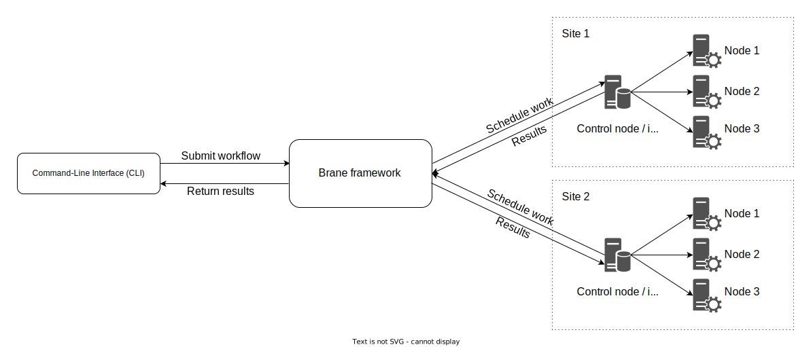

# Overview
In this chapter, we will provide a brief overview of what the framework is, how it is build and what kind of features it supports.

It is not, however, a complete, technical description of its implementation; for that, we recommend you read our [other book](https://wiki.enablingpersonalizedinterventions.nl/specification).

## Brane: Programmable Orchestration of Applications and Networking
Regardless of the context and rationale, running distributed applications on geographically dispersed IT resources often comes with various technical and organizational challenges. If not addressed appropriately, these challenges may impede development, and in turn, scientific and business innovation. We have designed and developed Brane to support implementers in addressing these challenges. Brane makes use of containerization to encapsulate functionalities as portable building blocks. Through programmability, application orchestration can be expressed using intuitive domain-specific languages. As a result, end-users with limited or no programming experience are empowered to compose applications by themselves, without having to deal with the underlying technical details.

In context of the [EPI project](https://enablingpersonalizedinterventions.nl), Brane is extended to orchestrate data distribution as well. Because the project concerns itself with health data, this orchestration does not just include distributing the data, but also policing access and making sure that applications adhere to both global and local data access policies. The same applies to the network orchestration of Brane; here, too, we have to make sure that secure and policy-appliant networking between different sites is possible and automated by Brane.

## The framework in a nutshell
Concretely, the Brane framework is primarily designed to take an application in the form of a _workflow_ and perform the work specified in it over multiple nodes spread over multiple domains, to which we refer as _compute sites_. This basic idea is shown in figure 1.

_Figure 1: Schematic showing the abstraction Brane provides over multiple domains / compute sites. The framework orchestrates over multiple sites, where each sites orchestrates over its own nodes. Together, this allows the user to utilize the work of all compute sites together as if they were one._

An important design feature of Brane is that it tries to be intuitive in use for different _roles_ that users have when developing a workflow. We identify three: **system engineers**, who build and manage the compute sites; **software engineers**, who implement compute steps or algorithms; and **scientists**, who use the algorithms to write workflows that implement their research.

Since Brane's intergration into the EPI project, there is also a fourth role: that of **policy makers**, who define and write the policies that are related to data handling.

Finally, there is also a fifth, "hidden" role: the **Brane administrators**, who manage the framework itself.

This _separation of concerns_ means that the framework provides different levels of abstraction to interact with it, where each of these levels are designed to be familiar to the users who will use it.

For system engineers, the framework hosts a number of tools and configuration files that allow them to setup and specify their infrastructures; software engineers can write software in any language they like, and then package that using a script-like domain-specific language ([BraneScript]()); policy makers can define the policies in an already existing reasoner language called [eFLINT](); and for scientists, the framework provides a natural language-like domain-specific language to write the workflows ([Bakery]()), so their work is easily shareable with scientists who do not have extensive Brane knowledge.
