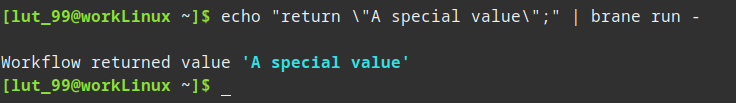

# Advanced workflows
In this chapter, we will discuss some loosely connected but very useful concepts for when your are writing more extensive and advanced workflows.


## Arrays
Another more complex form of an expression is an _array_. This is simply a(n ordered) collections of values, indexable by an integral number. They are very similar to arrays used in other languages.

To create an array, use the following syntax:
```bscript
[ <VALUE>, <ANOTHER-VALUE>, ... ]
```
Note that arrays are _homogeneous_ in the sense that all elements _must_ have the same type. For example, this will throw errors:
```bscript
let uh_oh := [ 42, "fourty two", 42.0 ];
```
Instead, assign it with values of the same type:
```bscript
let ok := [ 83, 112, 97, 109 ];
```

To index an array, use the following syntax:
```bscript
<ARRAY-EXPR> [ <INDEX-EXPR> ]
```
This may be a bit confusing, but the first expression is an expression that evaluates to an array to index (i.e., a literal array, a variable or a function call), and the second expression is an expression that evaluates to a number that is used as index. Some examples:
```bscript
let array1 := [ 1, 2, 3 ];
// Arrays are zero-indexed, so this refers to the first element
println(array1[0]);

let index1 := 2;
// And this to the last element
println(array1[index1])

// Some other examples using weirder expressions
println([ 4, 5, 6 ][1]);
println(generate_array_with_zeroes()[0]);
println(array1[zero()]);
```
This will print `1`, `3`, `5`, `0` and `1`, respectively.

Array indexing can be used to assign a value as well as read it:
```bscript
let array1 := [ "a", "b", "c" ];
array1[0] := "z";
println(array1);
// Will print '[ z, b, c ]'
```

Finally, when you have an array that you got from some function or other source that you don't know the size of, you can retrieve it using the builtin `len`-function:
```bscript
println(len([ 0, 0, 0 ]));
// Will print 3
```

This is very useful when iterating over an array with a for-loop (see [below](#for-loop)).


### Returning
A different kind of control flow statement is the return-statement. This is used to essentially halt the current control flow, and go to whatever was the calling context. In other languages, this is often used in [functions](TODO), but in BraneScript its used a bit more general.

The syntax is:
```bscript
return;
```
Writing this statement can be thought as a 'stop' or 'exit' command, and any statement following it (if not in a [branch](#if-statements)) can be ignored.

There are two possible ways to use a return statement:
- When used in a function, the function is exited immediately and the program resumes execution from the function call onwards (see the [next chapter](TODO)).
- When used in another context, the function exits the workflow entirely. This can be used to early-quit the workflow if desired.

For example, this workflow:
```bscript
println("Hello, ");
return;
println("world!");
```
will only print `Hello, `, not `world!`, because of the early quit in between the statements.

A really useful alternative syntax of the return-statement allows it to carry a value to the calling scope:
```bscript
return <EXPR>;
```
This is used to return a value from a function, or to return a value from a workflow.

For example, one can run this workflow in the Brane CLI:
```bscript
return "A special value";
```



While this doesn't seem a lot different than just printing, this actually matters in a few use-cases such as [automatically downloading datasets](TODO) or [creating a workflow package](TODO).


## Advanced parallelism
Note that there are a few peculiarities about parallel statements:
- The code inside the blocks is run in parallel, which means that the statement itself will only return once all of the branches do. To illustrate:
  ```bscript
  parallel [{
      println("The order of this print...");
  }, {
      println("...and this print may vary");
  }];
  println("But this print is only run after the other two finished");
  ```
- Instead of being able to refer to variables like normal, every branch receives its own _copy_ of those variables. In practise, this means that any changes they make to variables are only local to that branch. For example:
  ```bscript
  let value := 42;
  parallel [{
      println(value);   // Will print 42
  }, {
      value := 84;
      println(value);   // Will print 84
  }];
  println(value);   // Will still print 42!
  ```
- The order of execution of the branches is arbitrary (as hinted to above), as it depends on the scheduling of the runtime itself and of the OS' scheduling of the VM threads.
- In addition, although they are _said_ to run in parallel, in practise, the only guarantee is that each branch is run _concurrently_ (but still _may_ be run in parallel, depending on the setup). To understand the precise difference, check <https://freecontent.manning.com/concurrency-vs-parallelism/>.
- Each parallel branch forms their own "workflow": or, to be more precise, when your return in a parallel branch, it actually returns the branch - not the workflow. For example:
  ```bscript
  parallel [{
      println("1");
      return;
      println("2");
  }];
  println("3");
  ```
  will actually print `1` and `3`, in that order.
- The only way to return from a parallel branch is to use the _declaration syntax_ of the parallel statement. It looks like the parallel statement is assigned to a variable declaration:
  ```bscript
  let <ID> := parallel[{ <STATEMENTS> }, { <MORE-STATEMENTS> }, ...];
  ```
  If this syntax is used, then every branch _must_ return a value of the same type (using a return-statement). For example:
  ```bscript
  let jedis := parallel [{
      return "Obi-Wan Kenobi";
  }, {
      return "Anakin Skywalker";
  }, {
      return "Master Yoda";
  }];
  println(jedis);
  ```
  Will actually print [an array](#arrays) with the returned strings.
  >  Note that the undefined order of execution, the order of the array is also undefined; it is first-come first-serve, so it typically only makes sense to process these array using some loop (e.g., a [for-loop](#for-loop)).
- Finally, as a variation on returning an array, multiple _merge strategies_ exist to do different things with the result. For example, one such strategy is the `sum`-strategy, that simply adds the results returned by the parallel-statement. The syntax to define it is:
  ```bscript
  parallel [ <STRATEGY> ] [{
      <STATEMENTS>
  }, ...]
  ```
  To merge using `sum`:
  ```bscript
  let res := parallel [all] [{
      return 42;
  }, {
      return 42;
  }];
  println(res);
  ```
  which will print `84`.
  >  For a complete overview of all merge strategies, check the [BraneScript documentation](../../branescript/statements.md).
