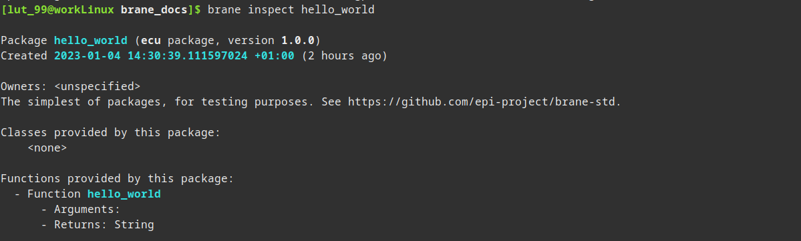
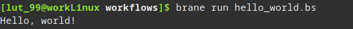
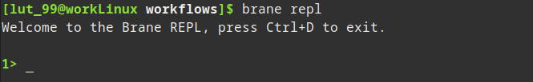
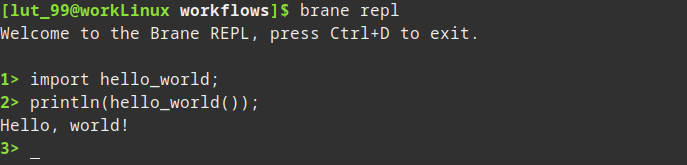

# Writing a full workflow
In Brane, the role of a scientist is to write _workflows_: high-level descriptions of some algorithm or other program that implements some goal. They are high-level by the fact that Brane will try to handle tedious stuff such as choosing the best location for each task, moving around datasets or even applying optimisations.

In this chapter, we describe the basics about writing workflow. Specifically, we will discuss how to write a workflow to run the `hello_world` package and print its output ([first section](#writing-a-workflow)), as well as how to run it or submit it to a remote instance ([second section](#running-a-workflow)). Finally, we also briefly discuss the Read-Eval-Print Loop (REPL), that provides a more interactive way of running workflows ([last section](#the-repl-and-the-notebook)).


## Writing a workflow
To write a workflow, all you have to do is open a plain text file with your favourite text editor. The name does not matter, but it is conventional to have it end in `.bs` or `.bscript` if you are writing in BraneScript. For this tutorial, we will use the name: `hello_world.bs`.

Next, it is good practise to write a header comment to explain what a file does. This gives us a good excuse to talk about BraneScript comments: everything after a double slash (`//`) is considered as one. So, a documentation header for this workflow might look like:
```branescript
// HELLO WORLD.bs
//   by Rick Sanchez
// 
// A BraneScript workflow for printing "Hello, world!" to the screen.
```

Next, we have to tell the Brane system which packages we want to use in our workflow. To do so, we will use the [`import`](../../branescript/statements.md#imports)-statement. This statement takes the identifier if the package, followed by a semicolon (`;`).

>  Note that all Brane statements end with a semicolon `;`. If you forget it, you may encounter weird syntax errors; so if you don't know what the error means but it's a syntax error, you should first check for proper usage of the semicolons.

We want to import the `hello_world` package, so we add:
```branescript
// ...

import hello_world;
```
This will import _all_ of the package's functions into the global namespace. Be aware of this, since this may lead to naming conflicts. See the [advanced workflows](./advanced-workflows.md#scoping)-chapter for ways of dealing with this.

In our case, this imports only one function: the `hello_world()` function. As you can read in the [package's README](https://github.com/epi-project/brane-std/tree/main/hello_world), this function takes no arguments, but returns a string who's value is: `Hello, world!`.

>  If you do not want to go to the internet to find out what a package does, you can also use the `inspect`-subcommand of the `brane`-executable:
> ```bash
> brane inspect hello_world
> ```
> which will print something like:
> 

Even though `hello_world()` is an external function, BraneScript treats it like any old function, which is done similarly like in other languages. So to call the package function, simply add:
```branescript
// ...

hello_world();
```
to your file.

However, running the file like this will probably not work. Remember that the package function _returns_ the string, not print it; so to show it to us, the user, we have to use the builtin `println()` function:
```branescript
// ...

// Use this instead, where we pass the result of the 'hello_world()'-call to 'println()'
// (as you would in other languages)
println(hello_world());
```
See the [BraneScript documentation](../../branescript/builtins.md) for a full overview of all supported builtins.

We now have a workflow that should print `Hello, world!` when we run it, which is what we set out to do!

The full workflow file, with some additional comments:
```branescript
// HELLO WORLD.bs
//   by Rick Sanchez
// 
// A BraneScript workflow for printing "Hello, world!" to the screen.

// Define which packages we use, which makes its functions available ('hello_world()', in this case)
import hello_world;

// Prints the result of the 'hello_world()' call by using the 'println()' builtin
println(hello_world());
```

Be sure to save it somewhere where you can find it. Remember, we will refer to it as `hello_world.bs`.


## Running a workflow
After you have written a workflow file, you can run it using the `brane` executable. Thus, make sure you have it installed and available in your PATH (see the [installation](../installation.md) chapter).

There are two modes of running a workflow: you can run it locally, in which all tasks are executed on your own machine and using the packages that are available locally. Alternatively, you can also run it on a remote instance, in which the tasks are executed on domains and nodes within that instance, using packages available only in that instance.

### Local execution
Typically, you test your workflow locally first to make sure that it works and compiles fine without consuming instance resources.

To run it locally, you first have to make sure you have all the packages available locally. For us, this is the `hello_world` package. You can check whether you have it by running `brane list`, and then install it if you don't by downloading it from GitHub:
```bash
brane import epi-project/brane-std hello_world
```
For more details on this, see the [previous chapter](../packages.md).

With the packages in place, you can then use the `brane run`-command to run the file we have just created:
```bash
brane run hello_world.bs
```
(Replace `hello_world.bs` with the path to the file you have created)

This will execute the workflow on your laptop. If it succeeded, you should something like:



If your workflow failed, Brane will try to offer you as much help as it can. Make sure that your Docker instance runs (use `sudo systemctl start docker` if you see errors relating to "Failed to connect to Docker") and that you written the workflow correctly, and try again.

>  Note that the execution of such a simply workflow may take slightly longer than you expect; this will take a few seconds even on fast machines. This is due to the fact that packages are implemented as containers, which have to be spun up and, if this is the first time you run a workflow, also loaded into the daemon.

### Remote execution
The procedure for executing a workflow on a remote instance is very comparable to running a workflow locally.

The first step is to make sure that the instance has all the packages you need. Use a combination of `brane search` and `brane push` to achieve this (see the [previous chapter](../packages.md) for more information).

Then, to execute your workflow, you can do the same _except_ that you have to specify the remote to connect to using the `--remote` option:
```bash
brane run --remote <ADDRESS> ...
```
Here, `<ADDRESS>` is the address of the remote instance to connect to. This should be the same as the instance to which you logged-in, except that you now also have to specify the port where you can reach the _driver_ of the instance. The default port for this is `50053`.

Thus, to run our workflow on the remote instance `http://example.com`, we would use to the following command:
```bash
# We assume your already executed 'brane login'

# We use the default port of '50053' for this one
brane run --remote http://example.com:50053 hello_world.bs
```

If your packages are in order, this should produce the same result as when executing the workflow locally.


## The REPL
As an alternative to writing an entire file and running that, you can also use the Brane Read-Eval-Print Loop (REPL). This is an interactive environment that you can use to provide workflows in a segmented way, typically providing one statement at a time and seeing the result immediately.

>  The REPL works in most cases, but it is known to be buggy for some design patterns (see subsequent chapters). If you run into an issue where something works in a file but not in a REPL, you can typically solve it by writing the separate statements in a single line. Please also let us know by [raising an issue](https://github.com/epi-project/brane/issues).

Because our workflow is so short, we will re-do it in the REPL.

First, open it by running:
```bash
brane repl
```
This should welcome you with the following:



The REPL-environment works similar to a normal terminal, except that it takes BraneScript statements as input.

We can reproduce our workflow by writing its two statements separately:
```branescript
// In the Brane REPL
import hello_world;
println(hello_world());
```
which should produce:



Which is the same result as with the separate file, instead that we've now interleaved writing and executing the workflow.

You can also use the REPL in a remote scenario, by providing the `--remote <ADDRESS>` option when running it, similar to `brane run`:
```bash
brane repl --remote http://example.com:50053
```
Every command executed in this REPL is executed on the specified instance.

>  In principle, executing the same workflow as a file or in the REPL as separate statements should give you the same result. Unfortunately, in the context of Brane, this might not hold true depending on the policies present in an instance. For example, some policies may want to have gaurantees about what happens in the next step of workflow, which is impossible for Brane to provide if it's executing the statements one-by-one. Thus, you can typically expect your workflow to be authorized more easily if it's running in one go as a file.


## Next
In the [next chapter](./workflows-data.md), we will treat datasets and intermediate results, which are an essential component to writing workflows. If you are already familiar with those, you can also check the [subsequent chapter](./advanced-workflows.md), which introduces the finer concepts of workflow writing. Alternatively, you can also checkout the full [BraneScript documentation](../branescript/introduction.md).
