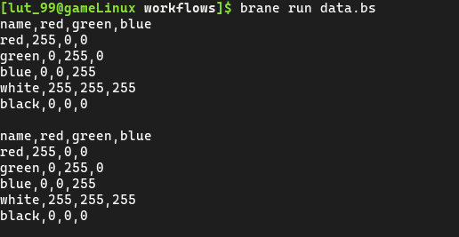

# Workflows and Data
In the [previous chapter](./workflow.md), we've discussed writing the simplest workflow possible in BraneScript. In this chapter, we will build on this, and examine the concepts of _data_ and _intermediate results_.

We will start by introducing the concepts of data and intermediate results as far as Brane is concerned. Then, we will write a second workflow in this series to use these concepts in practise. Finally, we will show you how to create a local dataset and then run your workflow.


## The Concept of Data
In Brane, there is a clear concept of so-called _Datasets_. These refer to (typically large) sources of data on which we want to execute one or more package functions.

In contrast to more conventional programming languages, you will never use a dataset directly from within a workflow. Instead, it is the job of a workflow to only specify which datasets are used in which package function, and then let the Brane framework handle the rest.

This way of managing data allows for it to be very opaque as far as the user is concerned. All they do is determine which dataset to use, and Brane will handle transferring the file around and making sure it is in a format that a package can use. Moreover, because the data is handled by the framework, we are able to subject it to _policies_, which are Brane's concept of high-level access control rules (see the chapters for [policy experts](../../policy-experts/introduction.md)).

A small extra detail to be aware of is the difference between what Brane calls a _Dataset_ and what it calls an _Intermediate Result_. As the name suggests, are intermediate results piece of data that are generate by a package function. They are exactly the same as data in any way, except that their lifetime is scoped to only the workflow it is running it; and that they are the only one of the two that is returned by functions.

Put differently, a dataset is something that can serve as the input to your workflow, and an intermediate result is something that is used within your workflow as an intermediate value. Thus, to return the result of any function from your workflow, you first have to promote it back to a dataset. The act of doing so is called _committing_, and Brane has a builtin function to do so.

>  The whole reason that this difference exists is to be more friendly to policy makers. It is very imaginable that there are rules saying that a dataset is allowed to be used in a computation, but _only_ if it is used within the same workflow that is known beforehand. This concept of intermediate results allows us to represent this.
> 
> Bearing this in mind, it is good practise to try and commit as little results as possible to fully datasets. Typically, you really only need to commit a single one - the final result, or else submit multiple workflows.


## Using Data in a Workflow
In this section, we will use the concept of Data in a workflow to see how one can use it in practise.

For this tutorial, we will write a workflow that prints the contents of a specific dataset and then creates a copy of it. To do so, we will use the [cat](https://github.com/epi-project/brane-std/tree/main/cat) and [copy_result](https://github.com/epi-project/brane-std/tree/main/copy_result) packages from the Brane standard library. Moreover, for now we will assume that there is some dataset with the identifier `colours` that we are interested in printing and copying.

To begin, create a second workflow file, which we will call `data.bs`. Open it with your favourite editor, and start by adding the import for the packages:
```branescript
import cat;           // Provides 'cat()', among others
import copy_result;   // Provides 'copy_result()'
```
Next, we will create a _Dataset reference_. This is what refers to a specific dataset, so that Brane knows what we are talking about. Dataset reference are done by some identifier, and are assumed to be unique within a single instance.

To create one, we will use the builtin `Data`-[class](../../branescript/statements.md#classes). It has only one field, `name`, which is the identifier of the dataset to use. We will create it as follows:
```branescript
// ...

new Data{ name := "colours" };
```
This is the generic BraneScript syntax for instantiating a class with a single field. Because `Data` is a builtin, however, Brane will treat it as a special value.

Note, however, that we currently do nothing with the created data reference; it is created and immediately dropped. To prevent this, we will store it in a [variable](../../branescript/statements.md#variable-declarations):
```branescript
// ...

// Instead of what we have above
let data := new Data{ name := "colours" };
```
This is a very common procedure in BraneScript, as well as in other languages.

Once we have a Data reference, using it becomes as easy as passing it to a package function that requires it. To do so, we can simply pass the variable as a value when calling it:
```branescript
// ...

// The 'cat()' function takes the dataset and the path to a file in that dataset (see below)
// It also returns a string, so don't forget to print it
println(cat(data, "-"));
```

>  Instantiating a class and referring to a variable are both expressions. Thus, you can also write the following, more concise form:
> ```branescript
> println(cat(new Data{ name := "colours" }, "-"));
> ```

You may note that the `cat()`-function actually takes two parameters: a data reference so that it knows the dataset to apply itself to, but also a second string. This string exposes a parculiarity about datasets that is good to know - see the box below.

>   As you can image, not all data is the same. It can have different formats (think tabular versus graphical), different encodings (plaintext or binary), or even a different file structure (one file versus many). This means that, even though all are referenced by the same kind of data reference, the actual format of the data varies wildly based on the specific dataset referenced.
> 
> This introduces an awkward incompatibility between various datasets that Brane currently has no elegant fix for. All that it guarantees is that the package function gets to see _some_ files, which may be of arbitrary format. It is not even defined if they see a single file or a directory, nor how that directory should look like. The burden is on software engineers to be explicit about the format that their software expects, and on you as a scientist to be mindful about which datasets or results you pass to which functions.

>  In the future, though, we hope to introduce some kind of _Data type system_ that can aid in dealing with this.

For the `cat`-function specifically, this extra argument defines which file you want to print in the dataset. Because our dataset will consist of a single file, we pass it `"-"` which has this meaning (see its [documentation](https://github.com/epi-project/brane-std/tree/main/cat)).

Our workflow is now able to print a specific dataset. We will now use the same data reference to copy it to a new one, for which we will use the `copy_result()` function.

>  Don't let the name of the function `copy_result()` mislead you; it can also be used to copy datasets instead of just results. The reason for this naming is that, for reasons discussed in the [first section](#the-concept-of-data), datasets are trivially convertible to a dataset, but not the other way around. Thus, accepting results tends to be more general than accepting datasets.

To apply the copy, add the following to your workflow file:
```branescript
// ...

let data_copy := copy_result(data);
```
The `copy_result()` function returns another reference to the result it creates, and by assigning it to `data_copy` it means that this variable now refers to the result of the function.

For completeness, we can show that the copied dataset is the same as the original one:
```branescript
// ...

// Add this below the copy
println(cat(data_copy, "contents"));
```
Note that we now have to specify `"contents"` instead of `"-"`. To see why, we refer you to the documentation of the [cat](https://github.com/epi-project/brane-std/tree/main/cat)-package.

The only thing left to do is to commit the result returned by the function to make it a persistent dataset. To do so, we use the `commit_result`-builtin:
```branescript
// ...

// This function takes the new name of the dataset first, and then the result itself
commit_result("colours_copy", data_copy);
```

This will make the result available under the `colours_copy` result in other workflows.

>  Be aware that the `colours_copy()`-function silently overrides existing datasets. This is typically what you want, since you often want the dataset to be updated when you re-run the same workflow. But be mindful not to cause naming conflicts with other datasets in your instance.

You can now save your file so that we can run it. For completeness, this is the entire workflow file:
```branescript
import cat;           // Provides 'cat()', among others
import copy_result;   // Provides 'copy_result()'

// Show the initial dataset
let data := new Data{ name := "colours" };
println(cat(data, "-"));

// Copy it to a new result, and then show that
let data_copy := copy_result(data);
println(cat(data_copy, "contents"));

// Make the result persistent under the name 'colours_copy'
commit_result("colours_copy", data_copy);
```


## Running a Workflow with Data
Running a workflow with Data goes exactly the same as running a workflow without. Make sure that your local machine or the remote instance has the packages available it needs to, and then run your file using the `brane run`-command (see the [previous chapter](./workflow.md#running-a-workflow) for more information).

However, there is one extra concern that comes into play when running a workflow with data; and that is that the dataset has to be available where you are running it.

On a Brane instance, available data is managed by the system administrators if the participating domains, so there is not much more to do except than contacting the instance administrators if your target dataset is missing.

Locally, however, Brane _does_ provide you with options of how to manage datasets. The remainder of this section will be spend on examining that.

The process of creating a dataset is threefold:
1. Collect the file you want to use
    - If you have multiple files, collect them all in the same folder
2. Write a so-called `data.yml` file that describes your data
3. _Build_ a data package using the `brane`-executable

### 1. Collecting data
The first step is pretty straightforward. For our tutorial, you should create a file and populate it with the following toy contents:
```
name,red,green,blue
red,255,0,0
green,0,255,0
blue,0,0,255
white,255,255,255
black,0,0,0
```
(If you haven't already guessed, the dataset provides RGB pixel values for certain colour names).

Store the file somewhere where you can reach it. We will assume it's available as `colours.csv`.

### 2. Writing a `data.yml` file
The next step is to describe your data. To do so, create a second file and write the following [YAML](https://yaml.org) contents:
```yaml
name: colours
access:
  kind: file
  path: ./colours.csv
```
This is the bare minimum required to describe a dataset so Brane can use it. In detail:
- `name`: This field defines the unique identifier for your dataset. This is the name that you use in BraneScript to refer to your dataset; that's why, in our case, it's called `colours`.
- `access`: This field describes how Brane can access your data. It always has the `kind`-field, and then other fields depending on the `kind` specified.
  - `kind`: This field describes how Brane may access your dataset. Because we're using a file, we define it as such; but you can also use `file` to mean a directory with files inside them. For a full list of options, see the [`data.yml` documentation](../../config/users/data.md).
  - `path`: This field is specific to datasets that are of the `file`-kind. It simply refers to the file (or directory) that contains the data itself. In our case, this is the `colours.csv` file that we created.
    >  Note that relative paths are relative to the `data.yml` file itself; so for this to work your should either place the `colours.csv` file in the same folder as the configuration file, or change the given path to point to your file.

There are more fields available for this file, which are optional. You can find them in the [`data.yml` documentation](../../config/users/data.md).

Save this file as well. We call it `data.yml`, as is its conventional name.

### 3. Building a data package
With the `data.yml` file written, it is time to have Brane create the data package for us.

To do so, open a terminal, and issue the following command:
```bash
brane data build data.yml
```
(Replace `data.yml` with the path to your YAML file if it's named differently or somewhere else)

This will cause Brane to add an entry for this file to its internal index. From this moment on, you can use the `colours` dataset in local workflows!

>  Because, typically, dataset files can be quite large, Brane will avoid copying it by default but instead just creates a link to it. This means, however, that if you remove the original file, the data package will become corrupted. To avoid this, you can run the build-command with the `--no-links` option:
> ```bash
> brane data build --no-links data.yml
> ```
> This _will_ create a copy of your file to the Brane data index. The copy will be removed again when you remove the package.

### The result
If you have created the local data package and the workflow file, you should now be able to run it and get something similar to:



which shows that both datasets are equal. Moreover, if you run:
```bash
brane data list
```
you should now see both the `colours` and `colours_copy` datasets!


## Next
Now that you are able to run package functions and work with data, you have the most elementary parts of writing workflows under your belt. A good next step is to examine the [BraneScript documentation](../../branescript/introduction.md) to learn all the features of the language, such as if-statements, for-loops or parallel-statements.

Alternatively, you can also go the [next chapter](./advanced-workflows.md) in this series that will deal with some pretty typical patterns and useful concepts in Brane. It assumes that you are either already famliliar with basic control flow in BraneScript (ifs, fors, whiles) or that you are at least able to recognize them.
