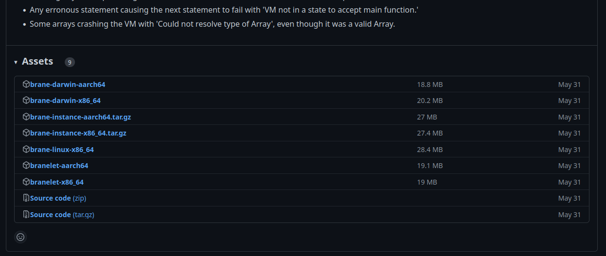

# Installation
In this chapter, we will discuss how to install the Brane Command-Line Tool, or the `brane`-executable, on your machine.

If you already have this executable available, you can [skip ahead](./packages.md) to the next chapter instead. If you do not, you should begin with the next chapter.

>  Aside from the `brane` executable, you may make your life easier by installing the Brane JupyterLab environment; check out its [repository](https://github.com/epi-project/brane-ide).


## Prerequisites
Before you can write and test workflows on your machine, make sure that you install the following:
- Install [Docker](https://docker.com) on your machine. You can refer to the official documentation to find how to install it for [Debian](https://docs.docker.com/engine/install/debian/), [Ubuntu](https://docs.docker.com/engine/install/ubuntu/), [Arch Linux](https://wiki.archlinux.org/title/docker), [macOS](https://docs.docker.com/desktop/mac/install/) or other operating systems.
- Install the [Docker Buildkit plugin](https://github.com/docker/buildx). Their [repository](https://github.com/docker/buildx#building) contains information on how to install it, but typically, the following works:
  ```bash
  # Clone the repo, CD into it and install the plugin (check https://github.com/docker/buildx#building for alternative methods if that fails)
  git clone https://github.com/docker/buildx.git && cd buildx
  make install
  
  # Set the plugin as the default builder
  docker buildx install
  
  # Switch to the buildx driver
  docker buildx create --use
  ```


## Downloading the binaries
The easiest way to install the `brane`-executable is by downloading it from the project's repository.

Head to https://github.com/epi-project/brane/releases/latest/ to find the latest release. From there, you can download the appropriate `brane` executable by clicking on the desired entry in the `Assets`-list:



_Example list of assets in a specific Brane release; you can click the one you want to download._

To know which of the executables you need, it helps to know the naming scheme behind the assets:
- Every asset starts with some name identifying the kind of asset. We are looking for the `brane` executable, so find one that starts with only `brane`.
- Next, the OS is listed. Linux users can select a binary with `linux`, whereas macOS users should select `darwin` instead.
- Finally, the processor architecture is listed. Typically, this will be `x86_64`, unless you are on a mac device running an M-series processor; then you should select `aarch64`.

So, for example, if you want to write workflows on a Linux machine, choose `brane-linux-x86_64`; for Intel-based Macs choose `brane-darwin-x86_64`, and for M1/M2-based Macs, choose `brane-darwin-aarch64`.

Once you have downloaded the executable, it is very useful to put it somewhere in your `$PATH` so that your terminal can find it for your. To do so, open up a terminal (`Ctrl`+`Alt`+`T` on Ubuntu) and type:
```bash
sudo mv <download_location> /usr/local/bin/brane
```
where you should replace `<download_location>` with the path of the downloaded executable.

For example, if you are running on an Intel-based Mac, you can typically use:
```bash
sudo mv ~/Downloads/brane-darwin-x86_64 /usr/local/bin/brane
```

To verify that the installation was succesfull, you can run:
```bash
brane --version
```
If you see a version number, the installation was successful; but if you see an error (likely something along the lines of `No such file or directory`), you should try to re-do the above steps and try again.

>  Note that the act of copying the `brane` executable to somewhere in your PATH is not necessary. However, if you don't, remember that you will have to replace all calls to `brane` with the path of where your downloaded the executable. For example, to verify whether it works, use this command instead:
> ```bash
> ~/Downloads/brane-darwin-x86_64 --version
> ```

>  If you see an error along the lines of `Permission denied`, you can try to give execution rights to the binary:
> ```bash
> sudo chmod +x /usr/local/bin/brane
> ```
> and try again.


## Compiling the binary
Instead of downloading the binary and running it, you can also choose to compile the binary yourself. This is usually only necessary if you need a cutting-edge latest, unreleased version, you have an OS or processor architecture for which there is no `brane`-executable readily available or you are actively developing the framework.

To compile the binary, we refer your to the [installation chapter for software engineers](../software-engineers/installation.md#compiling-the-binary), which contains information on how to do exactly this.


## Next
If you are able to run the `brane --version` command, you have installed your `brane` executable successfully! You can now move to the [next chapter](./instances.md), which contains information on how to connect to remote instances and manage your credentials. After that, continue with the chapter on [package management](./packages.md), or start by writing your first workflow in [BraneScript](./bscript/introduction.md).
