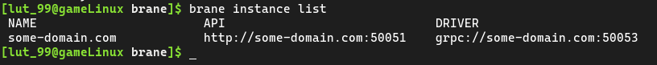
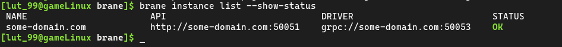
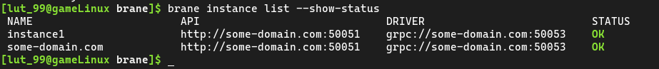
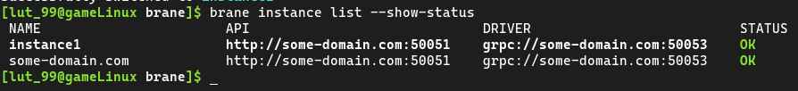
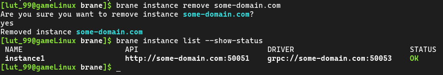
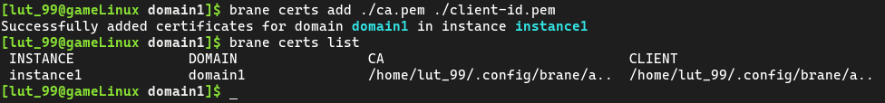
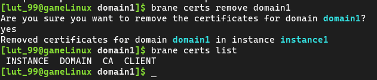

# Managing instances
The Brane framework has as main goal to act as an interface to one or more High-Performance Compute systems, such as cluster computers or grid computers.

To this end, it is often the case that you want to connect to such a system. In Brane terminology, this is called a _Brane instance_[^instance], and in this chapter we will discuss how you can connect to it.

In the [first section](#the-instance-command), we will discuss how to define an instance in the CLI and manage it. Then, in the [second section](#credentials) we will show how to add credentials (certificates) to the CLI as to easily use them when connecting to an instance.

[^instance]: It's a little bit more complex than presented here. A single Brane instance may actually abstract over multiple HPC systems at once, effectively acting as a "HPC orchestrator". However, from your point of view, the scientist, Brane will act as if it is a single HPC divided into separate domains.


## The instance-command
All of the commands for managing the basic information about instances is grouped under the `brane instance` subcommand in the `brane CLI`. We will assume in this chapter that you have already installed this tool, so consult the [installation chapter](./installation.md) if you did not.

In the CLI, instances are defined as separate entities that can be created and destroyed. Think of them as keys in a keychain, where each of them has a unique name to identify them, and furthermore carries information such as where to reach the instance or credentials to connect with.

If you have just installed the CLI, you won't have any instances yet. You can check this by running:
```bash
brane instance list
```
This should show you an empty table:


Let's change that by defining our own instance!


### Defining instances
For the purpose of this tutorial, we assume that there is a Brane instance running at `some-domain.com`, which is what we want to connect to.

The most basic form of the command to generate a new instance is as follows:
```bash
brane instance add <HOSTNAME>
```
where we want to replace `<HOSTNAME>` with the address where we can reach the instance.

For our example, you can run:
```bash
brane instance add some-domain.com
```
which then adds a new instance with default settings. You can see this by running `brane instance list` again:



This shows you the name by which you can refer to this instance and the addresses that the CLI uses to connect to this instance. In addition, you can also add the `--show-status` flag to ping the remote backend and see if it's online:



>  By default, the CLI will also ping the remote instance when you define it to help you to see if you entered the hostname correctly. If you want to disable this behaviour, or if you are not connected to the internet when you define a new instance, add the `--unchecked` flag:
> ```bash
> brane instance add <HOSTNAME> --unchecked
> ```


### Defining non-default instances
While the command used above is nice and concise, it is often desireable to change some properties about the instance upon creation.

One of such properties is the name of the instance. By default, this equals the hostname, but you can easily specify this to be something else using the `--name` option:
```bash
brane instance add <HOSTNAME> --name <SOME_OTHER_NAME>
```
For example:
```bash
brane instance add some-domain.com --name instance1
```
Inspecting the instance using `brane instance list` now shows:



>  As you can see, you can use the `--name` flag to define multiple instances that point to the same hostname. This might be useful if you have two sets of credentials you want to login with (see below).

There are other properties that can be set, too. You can inspect them using `brane instance add --help`, or consult this list:
- `--api-port <NUMBER>` changes the port number with which the CLI connects to the instance's registry. Leaving this to the default value is probably fine, unless the system administrator of the instance told you to use something else.
- `--drv-port <NUMBER>` changes the port number with which the CLI connects to the instance's execution engine. Leaving this to the default value is probably fine, unless the system administrator of the instance told you to use something else.


### Selecting instances
After you have created an instance, however, you must _select_ it before you can use it. This effectively tells the CLI that all subsequent commands should be executed on the selected instance, if relevant, until the selection is changed.

To do so, use the following command:
```bash
brane instance select <NAME>
```

For example:
```bash
brane instance select instance1
```

You can verify that you have selected an instance by running `brane instance list` again. The selected instance should be printed in **bold**:



>  When creating an instance, you can also add the `--use` flag to instantly select it:
> ```bash
> brane instance add <HOSTNAME> --use
> ```
> avoiding the need to manually call `brane instance select ...` afterwards.


### Editing instances
If you ever need to change some property of the instance, then you can use the `brane instance edit` subcommand to do so.

You can change the same properties from an instance as given during creation, _except_ for the name of an instance. To "change" the name of an instance, you have to re-define it with the same properties as the old one.

The properties that can be changed can be found when running `brane instance edit --help`, or else in this list:
- `--hostname`: Change the hostname where this instance lives. For example: `brane instance edit instance1 --hostname some-other-domain.com`.
- `--api-port`: Change the port number with which the CLI connects to the instance's registry.
- `--drv-port`: Change the port number with which the CLI connects to the instance's execution engine.

Note that you can specify multiple options at once, e.g.:
```bash
brane instance edit instance1 --hostname some-other-domain.com --api-port 42
```
changes both the hostname and the API port for the instance `instance1`.


### Removing instances
Finally, if you no longer have the need to connect to an instance, you can remove it using the following command:
```bash
brane instance remove <NAME>
```
When you attempt to remove it, `brane` will not do so before you have given confirmation. Simply hit `y` if you want to remove it (no need to press enter), or `n` if you changed your mind.

For example, if you run:
```bash
brane instance remove some-domain.com
```
and then hit `y`, you should no longer see it in the list generated by `brane instance list`:



If you remove a selected instance, then no instance will be selected afterwards, and you have to re-run `brane instance select` with a different one.

>  For unattended access, you can also provide the `--force` flag to skip the confirmation check:
> ```bash
> brane instance remove <HOSTNAME> --force
> ```
> Use at your own risk!

>  You can also specify multiple instance to remove at once, simply by giving multiple names. For example:
> ```bash
> brane instance remove some-domain.com instance1
> ```
> would remove both of those instances.
> 
> Note that you will only be asked for confirmation once.

And that's it for the basic instance mangement!


## Credentials
Aside from the basic properties of an instance, there is also the matter of credential management. After all, an instance may handle sensitive data, in which case it's paramount that a user is able to identify themselves.

A complicating factor in this story is that a Brane instance may consist of multiple _domains_ (for example, it may feature two hospitals who want to collaboratively run some workflow). The problem, however, if that they are both in charge of their own authentication scheme; while this is very nice for the hospitals, it gets a little complicated for you, the scientist, because you will have to have credentials for each domain with an instance. Typically, this will be a certificate, and every domain will provide you with one that proves you are who you say you are - but only on their domain.

>  Note that you don't have to have credentials for every domain to use the Brane instance. This is only relevant if you directly need to interact with a domain, and that is only relevant if a part of your workflow will be executed there or if you attempt to download a dataset from that domain.

For this section, we once again assume that there is some instance over at `some-domain.com` and that you have already defined an instance called `instance1` to refer to it (see the [previous section](#the-instance-command)). Additionally, we assume that you have been provided with the certificates for a domain called `domain1`: two files, `ca.pem` and `client-id.pem`.


### Adding certificates
Brane always assumes that a certificate pair for the purpose of connecting to a domain consists of two files:
- A _root certificate_, canonically called `ca.pem`, which allows the Brane CLI to detect if the remote domain is who they say they are. It is a public certificate, so it is not very sensitive.
- A _client identity file_, canonically called `client-id.pem`, which contains both the public and private parts of your key to that domain. Because of this private key, however, this file _is_ sensitive, so never share this with anyone!

Note, however, that it may be the case that the system administrator of the target domain provides you with a single file that contains both, or three files to separate the client certificate and key. Regardless, to add them to an instance, you can run the following command:
```bash
brane certs add <FILES>
```

By default, the CLI will add the certificates to the instance you have currently selected, but you can also use the `--instance` option to target some other instance.

So, for our certificates:
```bash
brane certs add ca.pem client-id.pem
```

Similarly to how you can use `brane instance list` to check your instances, you can use `brane certs list` to check your certificates:



>  Note that the `CA` and `CLIENT` mentioned in the table refer to the files generated by the command, not by your input. That means that regardless of how many certificate/key files you specify, it will always separate them into one CA file and one client file internally.

Note that the domain name is automatically deduced based on the issuer of the certificates. Typically, this is what you want, since the domain name is used automatically based on the name of the domain to which the CLI will connect. However, if necessary, you can manually specify it using the `--domain` flag.


### Removing certificates
Just as with instances, removing certificates is also useful at times. To do so, use the following command:
```bash
brane certs remove <DOMAIN>
```
This will remove the certificates for the given domain in the currently selected instance. Just as with `brane certs add`, you can remove them in another instance using the `--instance` flag, and just like `brane instance remove`, you can specify multiple domains at once to mass-delete them.

After running the command, the certificates will disappear again if you run `brane certs list`:



>  You can specify `brane certs list --all` to see all of the certificates in all of the instances.


## Next
Now that you can manage instances and their credentials, you are ready to start [managing the packages](./packages.md) available locally and in your Brane instance of choice. If that's already setup, you can start writing your own workflow! See the [chapter on BraneScript](./bscript/introduction.md) for how to do this.
