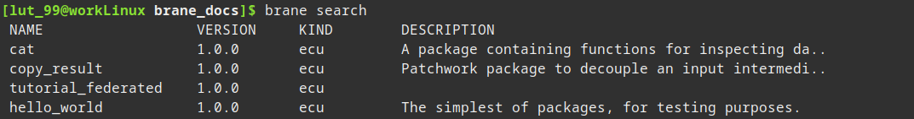
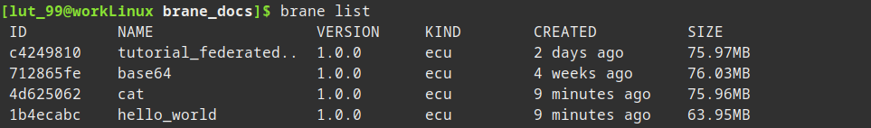

# Playing with packages
In this chapter, we will explain how to manage packages on your local system and push them to a remote instance for running your workflows.

Currently, Brane has three ways of obtaining packages that contain functions: [package code yourself](../software-engineers/introduction.md), download a package from GitHub or pull them from a _Brane instance_. The first option is typically the role of a software engineer, and so we focus on the latter two in this chapter.

We will first discuss where you can move packages to/from in the [first section](#package-locations). Then, in the two following sections, we will explain how to [get packages from GitHub](#downloading-packages-from-github) and [from a Brane instance](#pulling-packages-from-an-instance), respectively. Then, in the [section after that](#pushing-packages), we will also explain how to push the obtained packages to (another) Brane instance to use them, and we close by discussing how to remove packages in the [final section](#removing-packages).

Note that we assume that you are able to login to some remote instance, as described in the [previous chapter](./instances.md).


## Package locations
Brane packages can have two possible kinds of locations: they can be _local_, in which case they are only usable on your machine; or they can be _remote_, in which case they are usable in some Brane instance.

Typically, you first download a package to your local machine from whatever source (see the [next section](#downloading-packages-from-github) and the [section after that](#pulling-packages-from-an-instance)) to play around with it and to test your workflows; and then, when you are ready to schedule the workflow "for real", you push them to a remote instance and submit your workflow there.

// TODO package diagram

Another thing to note is that every Brane instance will also host its own package repository. So another instance of where you have to manage packages is to pull a package from one instance to your local machine, and then push it to another instance for use there.


## Downloading packages from GitHub
The first method to download a package is by downloading it from GitHub using the `brane`-executable. You can find how to install this tool in the [installation chapter](./installation.md).

>  Of course, you can easily download the packages manually from GitHub and then build them as if you wrote the package yourself. See the [chapters for software engineers](../software-engineers/introduction.md) on how to do that. This section focusses on using the more convenient method provided by `brane`.

As an example repository, we will use the [brane-std](https://github.com/epi-project/brane-std) repository. It provides a set of packages that are useful in general scenarios, and so can be thought of as a kind of standard library for Brane.

Before we can install a package from a repository, first we have to find the identifier of the repository. This identifier is written as the GitHub user or organisation name, a slash, and then the name of the repository. Or, more precisely, the identifier is the part of the URL of a repository that comes after `https://github.com/`. For example, for the standard library, which can be found at https://github.com/epi-project/brane-std, the ID would be:
```
epi-project/brane-std
```

To download a package and install it locally, you can use the following command:
```bash
brane import <REPO> <FILE>
```
where `<REPO>` is the identifier of the repository, and `<FILE>` is the path to the package to download in that repository. Note that you have to refer to the `container.yml` file (or similar) for that package; consult the documentation of the package to find which file to refer to specifically.

>  If the target repository contains only one package such that there is a `container.yml` file in the root of the repository, you can also omit the `<FILE>` argument.

So, for example, to download the `hello_world` package from the standard library:
```bash
brane import epi-project/brane-std hello_world/container.yml
```

Brane will then download the package and install it, making it available for local use.


## Pulling packages from an instance
Another method is to pull a package from a remote instance to your local machine so you can distribute it later.

To use it, you first have to define and then select an instance to work on. We won't go into detail here; consult the [previous chapter](./instances.md) for that. Instead, you can use this command to quickly log into an instance if you haven't already:
```bash
brane instance add <ADDRESS> --use
```
where `<ADDRESS>` is the URL where the instance may be reached.

>  If the above command fails, you may want to retry it with the `--unchecked` flag behind it:
> ```bash
> brane instance add <ADDRESS> --use --unchecked
> ```
> However, note that if it works with this flag, it means the remote instance isn't available - so any of the subsequent commands won't work either.

Once logged-in, you can fetch a list of available packages by using:
```bash
brane search
```

Which should display something like:



Then you can use the `brane pull` command to pull one of the available packages:
```bash
brane pull <ID>
```
where `<ID>` is typically the name of the package. However, if you want to download a specific package version instead of just the latest version, you can also use `<NAME>:<VERSION>`.

For example, to download the `hello_world` package from an instance that is reachable at `some-domain.com`:
```bash
# Needs only doing once
brane instance add some-domain.com --use

# Pull the package
brane pull hello_world
# Or, to pull version 1.0.0 specifically:
brane pull hello_world:1.0.0
```

>  Note that you only have to login once, which is then saved and remembered until you manually login to another instance later.


## Pushing packages
Aside from making packages available on your local machine, you also need the ability to publish packages to a remote instance.

>  Note that this action makes packages available for everyone with access to that instance. Make sure that you have permission to do so before you publish a package.

To publish a package, you first have to make sure you are logged-in to an instance. If you have not already in the [previous section](#pulling-packages-from-an-instance), do so by running:
```bash
brane instance add <ADDRESS> --use
```
where `<ADDRESS>` is the URL where the instance may be reached. Consult the [previous chapter](./instances.md) for more information on this and related commands.

Then, you can find a list of the packages installed locally by running:
```bash
brane list
```
which should return something like:



Next, you can push the latest version of a package to the remote instance by using:
```bash
brane push <ID>
```
where `<ID>` is the name of the package. However, if you want to download a specific package version, you can also use `<NAME>:<VERSION>`.

For example, to push the package `hello_world` to an instance that is reachable at `some-domain.com`:
```bash
# Needs only doing once
brane instance add some-domain.com --use

# Push the package
brane push hello_world
# Or, to push version 1.0.0 specifically:
brane push hello_world:1.0.0
```


## Removing packages
Finally, Brane conveniently offers you functions for removing existing packages without diving into filesystems.

### Local packages
For local packages, you can use the following command:
```bash
brane remove <ID>
```
where `<ID>` is the name of the package. If you want to delete a specific version instead of _all_ its versions, you can use `<NAME>:<VERSION>` instead.

For example, to remove the `hello_world` package from the local repository:
```bash
brane remove hello_world
# Or, a specific version:
brane remove hello_world:1.0.0
```

>  Don't worry - Brane will always ask you if you are sure before removing a package. Should you want to consciously skip that, however, you can use the `--force` flag to skip the check:
> ```bash
> brane remove hello_world --force
> ```
> Use at your own risk.

The same can be done for remote packages, except that you should use `brane unpublish` instead:
```bash
brane unpublish <ID>
```
```bash
# Don't forget to login first if you haven't already - you are interacting with an instance again
brane instance add some-domain.com --use

# For hello_world:
brane unpublish hello_world
# Or a specific version:
brane unpublish hello_world:1.0.0
```


## Next
Now that you can manage packages, it is finally time to move on to that which you are here to do: write workflows. There are multiple languages to choose from; you can go to the [next chapter](./bscript/workflow.md) for BraneScript, or to the [Bakery chapter](./bakery/workflow.md) for the Bakery language.

However, if you already have a basic idea, you can also skip ahead to further chapters in each language to discuss increasingly advanced concepts. Alternatively, you can also just check the more extensive tutorials on [BraneScript](../branescript/introduction.md) or [Bakery documentation](../bakery/introduction.md) in their own series of chapters.
