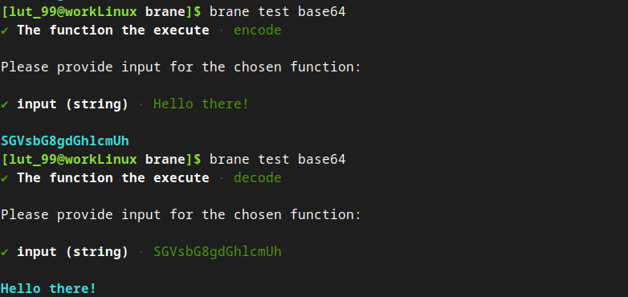
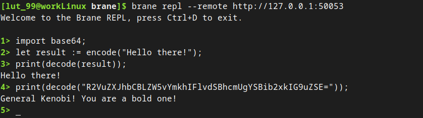

# Package inputs & multiple functions
In the [previous chapter](./hello-world.md), you created your first package, and learned how to build and run a function that take no inputs.

However, this makes for boring workflows. Thus, in this chapter, we will extend upon this by creating a container with multiple functions, and where we can pass inputs to those functions. Concretely, we will describe how to implement a _Base64_ package, which will contain a function to encode a string and decode a string.

>  The resulting code of this tutorial is included in the repository (`examples/doc/base64`).


## 1. Writing code
To implement the package, we will write a simple Python script that contains the two functions.

First, create the directory for this package. We will call it `base64`. Then, create a Python file `code.py` with the skeletons for the two functions:
```python
#!/usr/bin/env python3


# Imports
# TODO


# The functions
def encode(s: str) -> str:
    """
        Encodes a given string as Base64, and returns the result as a string
        again.
    """

    # TODO


def decode(b: str) -> str:
    """
        Decodes the given Base64 string back to plain text.
    """

    # TODO


# The entrypoint of the script
if __name__ == "__main__":
    # TODO
```

>  You may notice the `str` in the function header. If you're unfamiliar with it, this annotes the types of the arguments. If you're interested, you can read more about it [here](https://docs.python.org/3/library/typing.html).

The functions themselves are pretty straightforward to implement if we employ the help of the `base64` module, which is part of the Python standard library. Thus, import it first:
```python
# Imports
import base64

...
```

The implementation of `encode()`:
```python
...

def encode(s: str) -> str:
    """
        Encodes a given string as Base64, and returns the result as a string
        again.
    """

    # First, get the raw bytes of the string (to have correct padding and such)
    b = s.encode("utf-8")

    # We simply encode using the b64encode function
    b = base64.b64encode(s)

    # We return the value, but not after interpreting the raw bytes returned by the function as a string
    return b.decode("utf-8")

...
```

The implementation of `decode()` is very similar:
```python
...

def decode(b: str) -> str:
    """
        Decodes the given Base64 string back to plain text.
    """

    # Remove any newlines that may be present from line splitting first, as these are not part of the Base64 character set
    b = b.replace("\n", "")

    # Decode using the base64 module again
    s = base64.b64decode(b)

    # Finally, we return the value, once again casting it
    return s.decode("utf-8")

...
```

Up to this point, we are just writing a Python package; Brane is not yet involved.

But that will change now. In the entrypoint of our package, we have to do two things: we have to let Brane select which of the functions to call, and we have to be able to take the input that Brane presents us with.

The first is done by specifying a command-line argument (see below). Thus, we will write a piece of code that reads the first argument passed to the script, and then uses that to select the function.
```python
...

# The entrypoint of the script
if __name__ == "__main__":
    # Make sure that at least one argument is given, that is either 'encode' or 'decode'
    if len(sys.argv) != 2 or (sys.argv[1] != "encode" and sys.argv[1] != "decode"):
        print(f"Usage: {sys.argv[0]} encode|decode")
        exit(1)

    # If it checks out, call the appropriate function
    command = sys.argv[0]
    if command == "encode":
        result = encode(<TODO>)
    else:
        result = decode(<TODO>)

    # TODO
```

Don't forget to import the `sys` module:
```python
# Imports
import base64
import sys

...
```

However, to call our functions, we will first have to know the input that the caller of the function wants to be encoded or decoded.

Brane does this by passing the values as environment variables. The names of these variables are derived from the `container.yml` file (see below), but let's for now just assume that it's called: `INPUT`. Thus, to give our functions their input, we can just pass them the value of the `INPUT` environment variable:
```python
...

if __name__ == "__main__":
    ...

    # If it checks out, call the appropriate function
    command = sys.argv[0]
    if command == "encode":
        result = encode(os.environ["INPUT"])
    else:
        result = decode(os.environ["INPUT"])

    # TODO
```

Again, don't forget to add our new dependency on the `os` module:
```python
# Imports
import base64
import os
import sys

...
```

Now, finally, we have to give the result back to Brane like we did before.

We will do so in a slightly complicated manner, using the `yaml` package of Python. This is both to show that Brane just expects YAML, and it gives us an opportunity to talk about package dependencies later on.

To return the values, we will return the value as a YAML key/value pair with the key name called `output`:
```python
...
if __name__ == "__main__":
    ...

    # Print the result with the YAML package
    print(yaml.dump({ "output": result }))

    # Done!
```
Finally, add the `yaml`-module dependency:
```python
# Imports
import base64
import os
import sys
import yaml

...
```

And that gives us the final `base64/code.py` Python file that implements the `base64`-package:
```python
#!/usr/bin/env python3


# Imports
import base64
import os
import sys
import yaml


# The functions
def encode(s: str) -> str:
    """
        Encodes a given string as Base64, and returns the result as a string
        again.
    """

    # First, get the raw bytes of the string (to have correct padding and such)
    b = s.encode("utf-8")

    # We simply encode using the b64encode function
    b = base64.b64encode(b)

    # We return the value, but not after interpreting the raw bytes returned by the function as a string
    return b.decode("utf-8")


def decode(b: str) -> str:
    """
        Decodes the given Base64 string back to plain text.
    """

    # Remove any newlines that may be present from line splitting first, as these are not part of the Base64 character set
    b = b.replace("\n", "")

    # Decode using the base64 module again
    s = base64.b64decode(b)

    # Finally, we return the value, once again casting it
    return s.decode("utf-8")


# The entrypoint of the script
if __name__ == "__main__":
    # Make sure that at least one argument is given, that is either 'encode' or 'decode'
    if len(sys.argv) != 2 or (sys.argv[1] != "encode" and sys.argv[1] != "decode"):
        print(f"Usage: {sys.argv[0]} encode|decode")
        exit(1)

    # If it checks out, call the appropriate function
    command = sys.argv[0]
    if command == "encode":
        result = encode(os.environ["INPUT"])
    else:
        result = decode(os.environ["INPUT"])

    # Print the result with the YAML package
    print(yaml.dump({ "output": result }))

    # Done!
```


## 2. Creating a `container.yml`
With the code complete, we will once again create a `container.yml`.

Again, write the package metadata first, together with the files we will copy over and the entrypoint:
```yaml
name: base64
version: 1.0.0
kind: ecu

files:
  - code.py

entrypoint:
  kind: task
  exec: code.py
```
It is important to note that, because Brane will call the file we specify it, it's important to have the shebang string (`#!/usr/bin/env python3`) at the start of the file so the underlying OS will know which interpreted to use for the file.

Then, we will add one extra line, which will let Brane install Python and the `yaml` module for Python in the package container:
```yaml
...

dependencies:
  - python3
  - python3-yaml
```
The dependencies are just [apt](http://manpages.ubuntu.com/manpages/bionic/man8/apt.8.html) packages for [Ubuntu 20.04](https://packages.ubuntu.com/focal/). If you require another OS or system, you should check the in-depth [`container.yml` documentation](../packages/container_yml.md).

Next, we once again write the section that describes the functions. However, this time, we have two functions (`encode` and `decode`), and so we will create two entries:
```yaml
...

actions:
  encode:
    command:
      # TODO
    input:
      # TODO
    output:
      # TODO

  decode:
    command:
      # TODO
    input:
      # TODO
    output:
      # TODO
```

First, we will fill in the `command`-field.

If you look back at our `code.py` file, you see that we decide which function to run based on the argument given to the script. Thus, we should reflect this in the `command`-field of each function:
```yaml
...

actions:
  encode:
    command:
      # This is just a list of arguments we pass to the function
      args:
      - encode
    input:
      # TODO
    output:
      # TODO

  decode:
    command:
      args:
      - decode
    input:
      # TODO
    output:
      # TODO
```
For other fields in the `command`-field, check the [`container.yml` documentation](../packages/container_yml.md).

Next, we will specify the input arguments to each function. For both functions, this is a simple string that we would like to encode.

Now, remember that Brane will pass the input arguments as environment variables. Because environment variables are (by convention) spelled with CAPS, Brane will translate the name you give to an input argument to an appropriate environment variable name (i.e., the same but all caps).

Thus, for each function, we define an input argument `input` (which translates to the `INPUT` in the `code.py` file) that is of type `string`:
```yaml
...

actions:
  encode:
    command:
      # This is just a list of arguments we pass to the function
      args:
      - encode
    input:
    - name: input
      type: string
    output:
      # TODO

  decode:
    command:
      args:
      - decode
    input:
    - name: input
      type: string
    output:
      # TODO
```

Finally, we will define an output (called `output` again) in much the same way as in the [Your first package](./hello-world.md) tutorial:
```yaml
...

actions:
  encode:
    command:
      # This is just a list of arguments we pass to the function
      args:
      - encode
    input:
    - name: input
      type: string
    output:
    - name: output
      type: string

  decode:
    command:
      args:
      - decode
    input:
    - name: input
      type: string
    output:
    - name: output
      type: string
```

The complete `container.yml` may be found in the project repository (`examples/doc/base64/container.yml`).


# 3. Building & Publishing the package
If you've done everything right, this will be exactly the same as with the previous tutorial.

First, we will build the package:
```bash
brane build ./container.yml
```

Once that's ready, test your package by running `brane test`:
```bash
brane test base64
```

If you test your encode function and then your decode function, you should get something along the lines of:



Once you've verified everything works, we will push it to the remote repository:
```bash
brane push base64
```
>  If you get errors saying that you haven't logged-in yet (or perhaps errors saying a file is missing), login first with `brane login`. Refer to the [previous tutorial](./hello-world.md#5-publishing-your-package) for more details.

And then, like before, we can use the REPL to interact with our package:
```bash
brane repl --remote http://<IP>:50053
```

For example, you can now do the following:



## Next
You should now be able to build most functions, congratulations!

In the [next chapter](./filesystem.yml), we will consider a last aspect of building packages: the shared filesystem. If you plan to do more serious data processing with Brane, we highly recommend you to check that chapter out.

Otherwise, check the in-depth documentation on the [package system](../packages/introduction.md). It will talk about the different types of packages, how they are implemented and the complete overview of the interface with code and the `container.yml` file.

You can also continue with the chapters for [scientists] to know more about how to write workflows, [BraneScript](../branescript/introduction.md) and [Bakery](../bakery/introduction.md).
