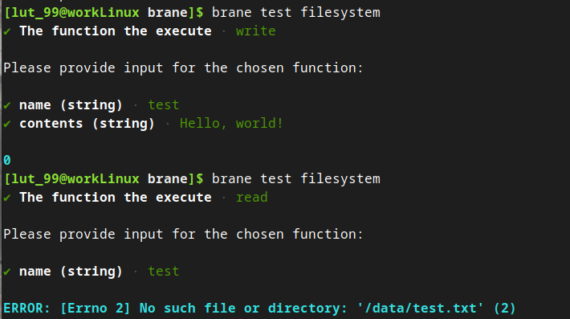
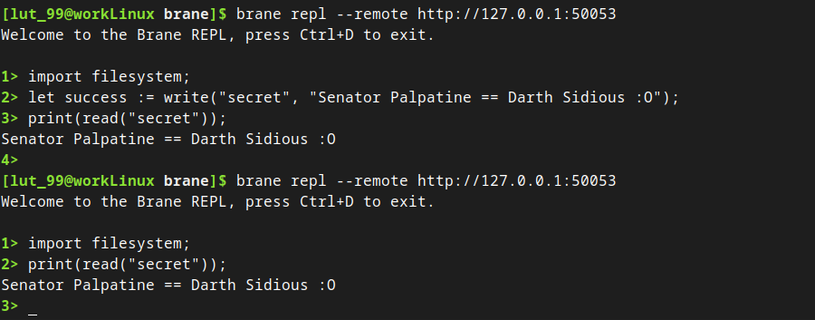

# The shared filesystem
Now that you have created packages with various inputs and an output (in the [previous tutorial](./base64.md)), there is one more thing that is very useful to know: using the shared filesystem.

In this tutorial, we will explain how this works and how you may use it by creating a simple "filesystem", which can write data to and from this shared filesystem.

>  The resulting code of this tutorial is included in the repository (`examples/doc/filesystem`).


## 1. Writing code
As before, writing any package starts by writing code. The code itself is not very exciting, and so we will offer it in one go. You can read through its comments if you want to know more.

Simply put, Brane uses [JuiceFS](https://juicefs.com/?hl=en) to mount a shared [Redis](https://redis.io/) filesystem as a normal Linux directory. In containers, this filesystem will be available under the `/data` folder, which means that anything you write there will outlive the function call.

This is relevant because the functions are implemented as containers. This means that everything you write to disk will not be visible by other packages. Additionally, because the containers are destroyed after they have completed, any files written won't even persistent until the next function call in the same package - unless you use the `/data` partition.

Knowing that, the following code implements a simple package in Python that can write arbitrary strings to a file under the `/data` partition in one function, and read the files and return their contents in another:
```python
#!/usr/bin/env python3

# Imports
import os
import sys
import yaml


# The functions
def write(name: str, contents: str) -> int:
    """
        Writes a given string to the distributed filesystem.
    """

    # We wrap the writing in a try/catch so we may catch any errors
    try:
        # Open the file and write the content
        with open(f"/data/{name}.txt", "w") as f:
            f.write(contents)

        # Return 0 (i.e., "success")
        return 0

    # Catch file errors
    except IOError as e:
        # Return the non-zero exit code that they define
        return e.errno


def read(name: str) -> str:
    """
        Reads the given file in the distributed filesystem and returns its contents.
    """

    # Once again we wrap the reading in a try/catch so we may catch any errors
    try:
        # Open the file and read the content
        with open(f"/data/{name}.txt", "r") as f:
            content = f.read()

        # Return the string
        return content

    # Catch file errors
    except IOError as e:
        # Return the error message
        return f"ERROR: {e} ({e.errno})"


# The entrypoint of the script
if __name__ == "__main__":
    # Make sure that at least one argument is given, that is either 'write' or 'read'
    if len(sys.argv) != 2 or (sys.argv[1] != "write" and sys.argv[1] != "read"):
        print(f"Usage: {sys.argv[0]} write|read")
        exit(1)

    # If it checks out, call the appropriate function
    command = sys.argv[1]
    if command == "write":
        # Write the file and print the error code
        print(yaml.dump({ "code": write(os.environ["NAME"], os.environ["CONTENTS"]) }))
    else:
        # Read the file and print the contents
        print(yaml.dump({ "contents": read(os.environ["NAME"]) }))

    # Done!
```
(Don't forget the [shebang](https://en.wikipedia.org/wiki/Shebang_(Unix)) at the top of the file!)

Save this code as `code.py` in a package folder (we'll use `filesystem`), and then move on to creating the `container.yml`.


## 2. Creating a `container.yml`
Because the distributed filesystem is not enabled or disabled on a per-package basis, the `container.yml` does not differ greatly compared to the previous tutorial(s).

That said, you may have noticed that the `write()` function returns an `int` instead of a `str`, which gives us the opportunity to talk about different variable types than strings.

Like most scripting languages, BraneScript has a concept of `types` that determine how a variable is represented in memory. Up to now, we have only used the `string`-datatype, which represents the data as a simple unicode string. Another example is the new `integer`-datatype, which represents the data as an integral number. For a complete list, check the [BraneScript](../branescript/types.md) documentation.

The `container.yml` file for the `filesystem` package looks as follows:
```yaml
name: filesystem
version: 1.0.0
kind: ecu

files:
- code.py

entrypoint:
  kind: task
  exec: code.py

dependencies:
- python3
- python3-yaml

actions:
  write:
    command:
      args:
      - write
    input:
    # Note: we now have two inputs for the write() function
    - name: name
      type: string
    - name: contents
      type: string
    output:
    # Note: its output is an integer!
    - name: code
      type: integer

  read:
    command:
      args:
      - read
    input:
    - name: name
      type: string
    output:
    - name: contents
      type: string
```
Most of it should already be familiar, but you can refer to the [previous tutorial](./base64.md#2-creating-a-containeryml) for more information.

The new part is the `type: integer` line for the `output:` section in the `write` function. Additionally, you may also notice that we supply multiple input arguments and use different names for the input and output arguments to show how a more complicated `container.yml` looks like.

Once you've written the file to `filesystem/container.yml`, we can move on to the really interesting part of this tutorial: running your package.


# 3. Building & Testing the package
As before, you first have to build your package:
```bash
# We assume you CD'ed into the "filesystem" folder
brane build ./container.yml
```

Then, you can test it. However, local Brane operations (i.e., `brane test` and `brane repl` without `--remote`) don't mount a `/data` folder by default. Thus, if you were to test your package without mounting one, the following would happen:



If the filesystem were properly persistent, the second call would have worked; but instead, we see that it finds no such file.

Note, though, that the _first_ package call (to `write()`) returned a success code (`0`; check the comments of the Python file). Even though the `/data` folder does not point to a shared folder, it does exist, which means that the package simply writes the file to a container-local folder, which gets cleared once the package call returns. Thus, when using the the shared filesystem, it's important to remember that errors with it might _only_ be visible when retrieving the data.

Let us now test the package properly. Make sure you have a local folder prepared that you want to use as the shared folder; we will call it `./data`. To mount it, provide the `--data` option to the `brane test` command:
```bash
brane test --data ./data filesystem
```

Now, the functions work as expected:


Because we have mounted a local folder as the `/data` folder, you should be able to see a file `test.txt` in the folder you mounted.

The same principle applies to the `brane repl` command. It, too, needs to mount a local folder, which you can designate using the `--data` option.


# 4. Publishing the package
Less work is required if you want to send your package to a remote Brane instance. The administrator of the Brane instance will set the shared filesystem folder up for you, which means that you don't have to provide any `--data` option for the filesystem to work:



As you see, because it is persistent, it even works across REPL sessions.

When using the filesystem on a Brane instance, it is important to note that the filesystem is shared across _all_ REPL sessions, which includes those of other users. Be careful when writing to common locations or writing sensitive information.


## Next
You are now able to use the shared filesystem!

A common use-case for such a filesystem is to download or extract data from within a package to it so that other packages may use it. For example, if I have a `data.csv` and embed that in a package (using the `files`-section in the `container.yml`), I can then copy it to the shared filesystem using some `extract()` package function. Then, other packages can easily use this dataset without having to re-download it again or having to pass it as huge strings in BraneScript.

Another common use-case is in combination with the [JupyterLab IDE](https://github.com/epi-project/brane-ide). Your Brane packages can write results or even plots to the shared `/data` folder, which the IDE has also mounted. That way, you can easily visualise the images produced by Brane in the notebook, by loading them from the filesystem.

If you're interested in other types of Brane packages, you can follow the [next tutorial](./github.md). Otherwise, you can refer to the [Scientists](../scientists/introduction.md)-chapters to learn how to write workflows for Brane, or go to the [BraneScript](../branescript/introduction.md) documentation to learn more about Brane's DSL.
