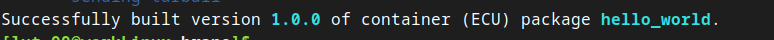
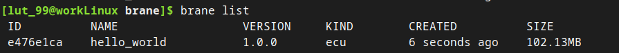
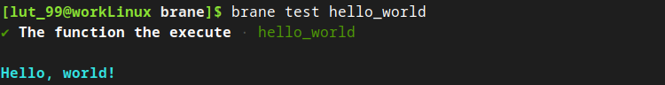
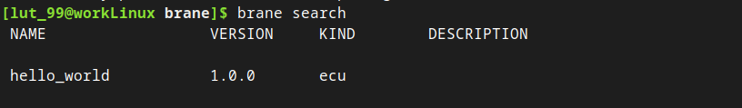
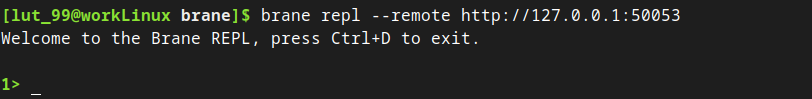

# Your first package
In this chapter, we will guide you through creating the simplest and most basic package available: the `hello world` package.

>  The result of this package may be found in the repository, under `examples/doc/hello-world`.


## 1. Writing the code
Because Brane will package your code as an Ubuntu container, you may choose virtually any language you like to write your code in.

For the purpose of this tutorial (because the code is very simple), we will write in [GNU Bash](https://www.gnu.org/software/bash/), which is a very commonly used Unix shell.

To begin, create a new directory (which we will call `hello-world`), and create a file `hello_world.sh`. All it does it printing: "Hello, world!", and so we only have to use an `echo`-statement:
```bash
#!/bin/bash
echo 'Hello, world!'
```

>  Note the [shebang](https://en.wikipedia.org/wiki/Shebang_(Unix)) at the top of the file: this special comment, `#!/bin/bash`, tells the terminal how it should run this script. If you omit it, it will try to run your script as a normal Linux executable - which will not work, as this is not binary code.

However, if were to build this as a package and launch it in Brane as it is, we wouldn't see anything. That's because Brane doesn't pass the stdout directly to the user; instead, it reads it and parses it **as YAML**.

Specifically, Brane will expect a YAML file as output that has a certain **key/value** mapping, where it will only return the result of a specific key. The name of this key is arbitrary; for this tutorial, we will call it `output`.

Thus, change your script to:
```bash
#!/bin/bash
echo 'output: "Hello, world!"'
```
which just writes the YAML equivalent of a key `output` with a value `Hello, world!`.

For now, this is all the code that we will package in a container, and so you can save the script and move to the next section.


## 2. Creating a `container.yml`
Every Brane (code) package exists of two components: the code to run and a file describing how to interface with the code. For us, the first part is the `hello_world.sh` script, and the second is a file conventionally called `container.yml`.

For this tutorial, we will only focus on the general file structure of the `container.yml` and how to read package output. The next tutorial will focus on how to partition a package into multiple functions and provide them with input.

The `container.yml` file describes a couple of things about your package:
- Metadata (name, version, kind, etc).
- Files and dependencies that should be added to the container
- The functions that your package implements and how they can be called.

We will go through these step-by-step.

Create a file `container.yml` in the `hello-world` directory, and populate it with the following to start:
```yaml
# The package metadata
name: hello_world
version: 1.0.0
kind: ecu
```
The first line (`name`) specifies the package name, and the second line (`version`) specifies the package version. Together, the provide a unique identifier for each package. This means that we can have multiple versions of the same packages around, which the framework will treat as different packages.

The third line (`kind`) is the most important one, because this specifies that this package contains arbitrary code (Executable Code Unit; see the [packages](../packages/introduction.md) series of chapters).

Next, we will specify the dependencies of this package. Because Bash is installed in the Ubuntu image by default, we only have to provide the files that should be copied over to the container, and then which file the container should run. Do this by adding the following to your file:
```yaml
...

# Specify the files to copy over (relative to the container.yml file)
files:
- hello_world.sh

# Specify which file to run
entrypoint:
  # 'task' means the script should be run synchronously (i.e., blocking)
  kind: task
  exec: hello_world.sh
```
As you can see, Brane supports only one entry point, even though a package may contain multiple functions. As you will see in the [next tutorial](./base64.md), Brane will tell your entrypoint which function to run by specifying certain command-line arguments or environment variables. However, because our script contains only one function, we do not worry about this; every time it is called, it will only ever have to return the `Hello, world!` message.

However, we still have to define this function. To do so, add the following lines to your `container.yml`:
```yaml
...

actions:
  "hello_world":
    command:
    input:
    output:
    - type: string
      name: output
```

This defines a function with the identifier "`hello_world`", that requires no input (`input:` is empty) and also doesn't need to pass any command-line arguments to the script (`command:` is empty). What is _does_ define, however, is that it should return the value of the `output`-key in the function's output. We define that value to be of type string, and the name of the key corresponds to the one we set in the `hello_world.sh` Bash script.

With that defined, your `container.yml` file should now look like this:
```yaml
# Container.yml for the hello_world package
name: hello_world
version: 1.0.0
kind: ecu

files:
  - hello_world.sh

entrypoint:
  kind: task
  exec: hello_world.sh

actions:
  'hello_world':
    command:
    input:
    output:
    - name: output
      type: string
```

We are now ready to build the package.


## 3. Building the package
To build a package, we will finally use the Brane CLI. We will assume that you have name it `brane`, and that it is reachable under the PATH of your machine.

To build the package, simply run the following from within the `hello-world` directory:
```bash
brane build ./container.yml
```

While the command above seems simple, there are a couple of semantics to think about:
- All relative paths in the file are relative to the `container.yml` file; use the `--workdir` option to change the working directory.
- Brane will automatically try to deduce the kind of the package based on the name of the file you specify it. `container.yml` will default to an `ecu` package (see the [packages](../packages/introduction.md) series of chapters). To change this, or if Brane could not deduce the package kind, use the `--kind` option to manually specify it.
- The CLI will automatically download the `branelet` executable that will live in the container from the repository. However, if you have a non-released version of the CLI in any way, you should probably build your own (download the repository as described [here](./installation.md#compiling-the-binary)) and pass it to the build command with the `--init` option.

If everything succeeds, you should see something along the lines of:



Your package is now available in the _local repository_ that only exists on your laptop. To verify it, you can run:
```bash
brane list
```
which should show you:



>  If you re-build your package with the same version, you may notice that your changes don't seem to be propagated when you test them locally (see below). In that case, you should remove the image from the local Docker engine: `docker image rm <image ID>` (you can get the image ID by running `docker image ls`) to force the engine to re-import your freshly built one.


## 4. Testing your package
Because publishing your package to a Brane instance immediately exposes it for others to use, it is often better to first test your package locally to catch any errors or bugs.

To do so, the Brane CLI provides a build-in test capability, which can run any function you defined in the package container with some (properly-typed) input and test its computation.

To run it for the `hello_world` package, run the following command:
```bash
brane test hello_world
```

You will then be greeted by something along the lines of:


This TUI (Terminal UI) will help you to select a function, give input to it (though now not relevant) and show its output.

If everything went alright, you should see the `Hello, world!` message if you hit 'enter':



If everything checks out, you are now able to push your package to a Brane instance.


## 5. Publishing your package
For this step, you will need to have a running Brane instance. If you do now have one where you can test this tutorial, you can download and install one yourself by following the steps in the [Brane: Guide For Administrators](https://wiki.enablingpersonalizedinterventions.nl/admins) book.

We will assume that you have a Brane instance available at `127.0.0.1` (localhost). If you will be using a remote instance, replace all of the occurrences of the localhost IP address with the address of your instance.

The first step, before you can publish to a cluster, is to login to one. Run the following command for that:
```bash
brane login http://127.0.0.1 --username <user>
```
where you should replace `<user>` with a name of your choosing. This is the name that will be used to 'sign' all your packages (i.e., list you as owner).

This command simply generates a config file, so regardless of whether this instance exists or not, you will only see it returning.

Next, you may try to publish your package by pushing it to the instance you just logged-in to:
```bash
bash push hello_world
```

This command will automatically push the latest version of your package to the remote instance. If you want to be explicit about which version to push, you may add it to the end of the command. For this tutorial, this command will give the same result as the one above:
```bash
brane push hello_world 1.0.0
```

Your package is now available in the remote instance. You can verify this by running:
```bash
brane search
```

This should show you something along the lines of:




## 6. Running your package
Finally, we can properly run the function that you have just created!

To do so, we will connect to the remote instance using the REPL (Read, Eval, Print-Loop) of the Brane CLI tool. This loop will take BraneScript statements line-by-line, and run them on the remote instance. Effectively, this will be like "interactively" running a workflow on the remote instance.

To start the REPL, run:
```bash
brane repl --remote http://127.0.0.1:50053
```

>  If you omit the `--remote` option from the command, you will run a local REPL instead. This can be used to test workflows and run package locally more thoroughly, and should work the same (except that you don't actually push anything to a Brane instance).

If the REPL launched and connected successfully, you will see:



Any command you write will be executed as BraneScript. For a more in-depth documentation of how BraneScript works, you can refer to its [documentation chapters](../branescript/introduction.md).

For now, we will restrict ourselves to testing our package.

First, we will bring the function that we have defined in our package into scope, by _importing_ the package:
```
import hello_world;
```

(Note the delimiter "`;`". BraneScript requires all stataments to be terminated by it.)

If the instance was able to find the package, then the command will return without printing anything. Next, you can call the function (without any arguments) to run your package on the instance:
```
hello_world();
```

After running that command, you should see:


Wait, we're not seeing anything?! Did something go wrong?!

No, it didn't! Remember, Brane never simply shows the user the stdout of the package. Instead, it uses the value of the parsed YAML field (in our case, `output`) as the return value of the function that we defined. Thus, if we wrap the `hello_world()`-call in a `print`-statement (a builtin in BraneScript), you will finally see:


>  You may notice that the second time, the package call went significantly faster than the first call. This is because Brane lazily imports packages in the Docker engine, which means that it still had to download the container during the first call, while it was already loaded during the second.

Congratulations! You have now written, built, published and then run your first Brane package.


## Next
In the [next chapter](./base64.md), we will consider a slightly more complicated case, where we will talk about passing inputs to functions and separating a package to have multiple functions. To do so, you will implement a simple Base64 encoding/decoding package.

Alternatively, you can also look at the [Package documentation](../packages/introduction.md) to find out the details of the different package types, or dive into BraneScript by reading its [documentation](../branescript/introduction.md).
