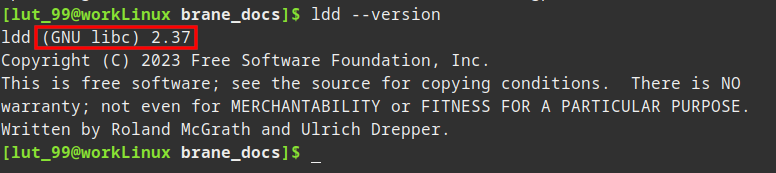

# Dependencies
The first step to install any piece of software is to install its dependencies.

The next section will discuss the runtime dependencies. If you plan to compile the framework instead of downloading the prebuilt executables, you must install _both_ the dependencies in the [Runtime dependencies](#runtime-dependencies)- and [Compilation dependencies](#compilation-dependencies) sections.


## Runtime dependencies
In all Brane node types, the Brane services are implemented as containers, which means that the number of runtime dependencies is relatively few.

However, the following dependencies are required:
1. You have to install [Docker](https://docker.com) to run the container services. To install, follow one of the following links: [Ubuntu](https://docs.docker.com/engine/install/ubuntu/), [Debian](https://docs.docker.com/engine/install/debian/), [Arch Linux](https://wiki.archlinux.org/title/docker) or [macOS](https://docs.docker.com/desktop/mac/install/) (note the difference between Ubuntu and Debian; they use different keys and repositories).
   - If you are running Docker on Linux, it is extremely convenient to set it up such that [no root is required](https://docs.docker.com/engine/install/linux-postinstall/):
     ```bash
     sudo usermod -aG docker "$USER"
     ```
     >  Don't forget to log in and -out again after running the above command to make the new changes effective.

     >  This effectively gives power to all non-root users that are part of the `docker`-group to modify any file as if they had root access. Be careful who you include in this group.
2. Install the [BuildKit plugin](https://docs.docker.com/buildx/working-with-buildx/) for Docker:
   ```bash
   # Clone the repo, CD into it and install the plugin
   # NOTE: You will need to install 'make'
   # (check https://github.com/docker/buildx for alternative methods if that fails)
   git clone https://github.com/docker/buildx.git && cd buildx
   make install

   # Set the plugin as the default builder
   docker buildx install
   
   # Switch to the buildx driver
   docker buildx create --use
   ```
   If these instructions don't work for you, you can also check the [plugin's repository README](https://github.com/docker/buildx#building) for more installation methods.
   >  Docker Buildx is included by default in most distributions of Docker noawadays. You can just run the `docker buildx install` and `docker buildx create --use` functions first, and if they work, skip the top ones.
3. Install [OpenSSL](https://www.openssl.org/) for the `branectl` executable:
   - Ubuntu / Debian:
     ```bash
     sudo apt-get install openssl
     ```
   - Arch Linux:
     ```bash
     sudo pacman -Syu openssl
     ```
   - macOS:
     ```zsh
     # We assume you installed Homebrew (https://brew.sh/)
     brew install openssl
     ```

Aside from that, you have to make sure that your system can run executables compiled against GLIBC 2.27 or higher. You can verify this by running:
```bash
ldd --version
```

The top line of the rest will show you the GLIBC version installed on your machine:



If you do not meet this requirement, you will have to compile `branectl` (and any other non-containerized binaries) yourself on a machine with that version of GLIBC installed or lower. In that case, also install the [compilation dependencies](#compilation-dependencies).


## Next
Congratulations, you have prepared your machine for running (or compiling) a Brane instance! In the [next chapter](./branectl.md), we will discuss installing the invaluable node management tool `branectl`. After that, depending on which node you want to setup, you can follow the guide for installing [control nodes](./control-node.md) or [worker nodes](./worker-node.md).
